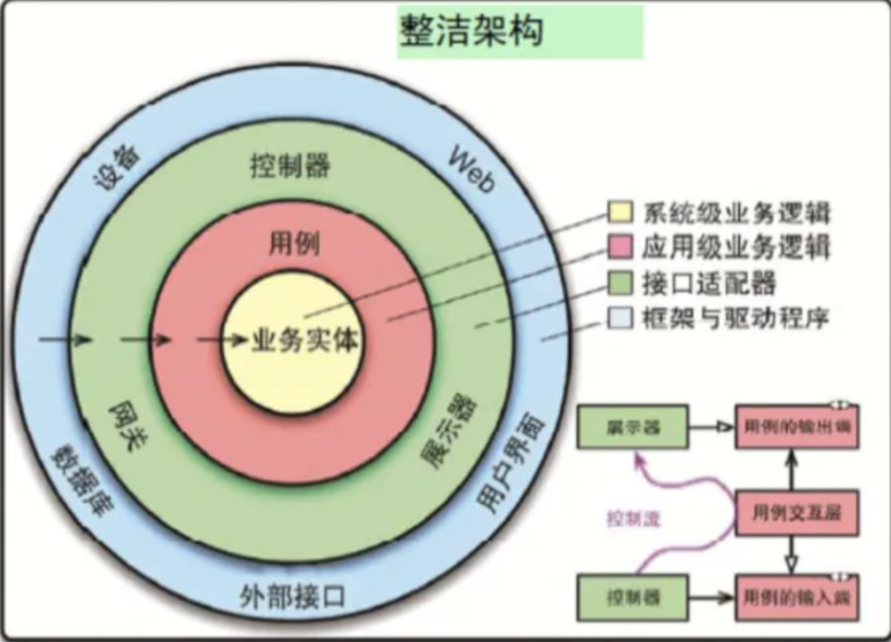

# 《架构整洁之道》读书笔记 - Clean Aechitecture

&ensp;&ensp;&ensp;&ensp;最近感觉网络上贩卖的焦虑实在是太多了, 其实以前也多多少少有这种感觉, 最近尤为严重, 可能也和开年后工作强度变大有关吧, 搞的身心比较疲惫. 一些专业性比较强的书也看不进去了, 拿起来之前没有看完的 Bob 大叔整洁系列的书慢慢看完了, 不得不说, 看书确实是一种比较好的降压方式, 本篇文章主要记录一些书中的内容.

## 1) 介绍

&ensp;&ensp;&ensp;&ensp;这本书为 Bob 大叔(Robert C. Martin)的著名作品, 同系列的还有《代码整洁之道》, 都是经典作品, 值得阅读. 该书系统的剖析了架构设计的缘起, 内涵以及应用场景.

- 第 1 部分描述架构设计的`重点`与`模式`

- 第 2~4 部分主要为`编程范式`

- 第 5 部分为架构设计中的`组件边界`、`设计模式`等

- 第 6 部分为`实现细节`
- 附录部分为作者的一些亲身经历等

&ensp;&ensp;&ensp;&ensp;这个系列其实还有一本作品 - 《代码整洁之道 - 程序员的职业素养》(The Clean Coder - A code of Conduct For Professional Programmers), 主要讲述作者的一些经历, 如何走上编程道路等, 同样推荐阅读. 读完不禁感叹, 大神的成长之路也不是一帆风顺的, 其中经验虽然不能说一定适用于现在, 但是完全值得我们学习和借鉴的.

<!--truncate-->

## 2) 设计与架构究竟是什么

### 1) 目标

软件架构的终极目标

```js
用最小的人力成本满足构建和维护该系统的需求;
```

### 2) 两个价值维度

可以从`两个价值维度`来描述

- #### 行为价值

是最直观的价值维度, 程序员的工作就是让机器按照某种指定方式运行, 给系统的使用者创造或者提高利润.

大部分程序员认为这就是他们的全部工作. 他们的工作是且仅是:

`按照需求文档编写代码, 并且修复任何Bug.`

这是大错特错的.

- #### 架构价值

软件系统的第二个价值维度, 是指软件的灵活性, 软件必须保持灵活.

从系统相关方的角度来看, 他们提出的一系列的变更需求范畴都是类似的, 因此成本也应该是固定的.

但是从研发者角度来看, 系统用户持续不断的变更需求就像是要求他们不停的用一堆不同形状的拼图块, 拼出一个新的形状, 整个过程将会越来越困难. `问题的根源就是系统的架构设计`

### 3) 哪个价值维度更重要

&ensp;&ensp;&ensp;&ensp;不同的人给出的答案会不一样. 业务部门觉得系统正常工作很重要, 很多开发人员也跟随采取了这种态度, 但是 Bob 大叔认为这种态度是错误的.

- 可以正常工作, 但是无法修改. 那么当需求变更时, 它将无法正常工作, 我们也无法修改, 因此价值为 0
- 无法正常工作, 易于修改. 可以随着续期变化不断修改, 不断产生价值.

### 4) 艾森豪威尔矩阵

|  重要且紧急  |   重要不紧急   |
| :----------: | :------------: |
| 不重要但紧急 | 不重要且不紧急 |

&ensp;&ensp;&ensp;&ensp;重要的事情占据了前面两位, 开发人员和业务部门经常犯的共同错误就是把第三优先级`不重要但紧急`的事情提到了第一优先级去做, 也就是说没有把`真正紧急且重要`和`紧急但是不重要`的功能分开, 这个错误导致了重要的事被忽略了, 重要的系统架构问题让位给了不重要的系统行为功能.

&ensp;&ensp;&ensp;&ensp;但是研发人员还忘记了一点, 那就是业务部门原本就是没有能力评估系统架构的重要程度的, `这本来就应该是研发人员自己的工作职责`.

&ensp;&ensp;&ensp;&ensp;如果忽视软件架构的价值, 系统将会变得越来越难以维护, 终会有一条, 系统将会变得无法修改. 如果系统变成了这个样子, 那么说明软件开发团队没有和需求方做足够的抗争, 没有完成自己应尽的职责.

## 3) 编程范式

&ensp;&ensp;&ensp;&ensp;编程范式指的是程序的编写模式, 与具体的编程语言关系较小, 这些范式会告诉你应该在什么时候采用什么样的代码结构. 直到今天, 我们也一共只有三个编程范式, 而且未来几乎不可能出现新的.

&ensp;&ensp;&ensp;&ensp;每个编程范式都从某一方面`限制`和`规范`了程序员的能力, 这些范式主要是为了告诉我们不能做什么, 而不是可以做什么.

### 1) 结构化编程

`结构化编程对程序控制权的直接转移进行了限制和规范`

主张限制`goto`等无限制的跳转语句, 使用熟知的`if/then/else/do/while/until`等语句来进行替换

### 2) 面向对象编程

`面向对象编程对程序控制权的间接转移进行了限制和规范`

三大特性为`封装`、 `继承`、 `多态`, 涉及到的概念还有`控制反转`(实现方式有`依赖注入`), 现代代表语言有 java 等...

### 3) 函数式编程

`函数式编程对程序中的赋值进行了限制和规范`

&ensp;&ensp;&ensp;&ensp;从理论上来说, 函数式编程语言中应该是没有赋值语句的, 大部分函数式编程语言只允许在非常严格的条件下, 才可以更改某个变量的值.

当然上面说的只是一种思想, 实际运用起来肯定还是有差别的, 现代代表语言有 golang 等...

## 4) SOLID 设计原则

&ensp;&ensp;&ensp;&ensp;通常来说, 想要构建一个好的软件系统, 应该从写整洁的代码开始(可以看看 Bob 大叔的《代码整洁之道》). `SOLID设计原则`就是用来解决这样的问题, 告诉我们如何组织数据和函数等.

### 1) S - 单一职责原则

&ensp;&ensp;&ensp;&ensp;基于`康威定律(Conway's Law)`的一个推论, 一个软件系统的最佳架构高度依赖于开发这个系统组织的内部结构. 这样, 每个软件的模块都有且只有一个需要被改变的原则.

康威定律: 软件架构能够反映出制作团队的组织架构

### 2) O - 开闭原则

&ensp;&ensp;&ensp;&ensp;由`Bertrand Meyer`在 20 世纪 80 年代大力推广, 核心要素为: 如果软件系统要想更容易被改变, 那么其设计就必须允许新增代码来修改系统行为, 而非只能靠修改原来的代码.

### 3) L - 里氏替换原则

&ensp;&ensp;&ensp;&ensp;由`Barbara Liskov`在 1988 年提出的一个子类型定义, 简而言之为: 如果要用可替换的组件来构建软件系统, 那么这些组件必须遵守同一个约定, 以便让这些组件可以相互替换.

### 4) I - 接口隔离原则

&ensp;&ensp;&ensp;&ensp;主要告诫软件设计师应该再设计中避免不必要的依赖

### 5) D - 依赖反转原则

&ensp;&ensp;&ensp;&ensp;该设计原则指出: 高层策略性的代码不应该依赖实现底层细节的代码, 恰恰相反, 那些实现底层细节的代码应该依赖高层策略性的代码

## 5) 软件架构

&ensp;&ensp;&ensp;&ensp;Bob 大叔书中有个观点我个人非常认可. 首先, `软件架构师自身需要是程序员, 并且必须一直坚持做一线程序员, 绝对不要听从那些说应该让软件架构师从代码中解放出来以专心解决高阶问题的伪建议`. 如果不亲身承受因系统设计而带来的麻烦, 就体会不到设计不佳所带来的的痛苦, 接着就会逐渐迷失正确的设计方向.

软件系统的架构质量是由它的构建者所决定的, 软件架构这项工作的实质就是:

`规划如何将系统切分为组件, 并且安排好组件之间的排列关系, 以及组件之间相互通信的方式.`

包含以下方面:

- #### 开发(Development)
- #### 部署(Deployment)
- #### 运行(Operation)
- #### 维护(Maintenance)

## 6) 整洁架构

### 1) 一些基本的架构特点

- 六边形架构
- DCI 架构
- BCE 架构

基本特点:

- 独立于框架
- 可被测试
- 独立于 UI
- 独立于数据库
- 独立于任何外部机构

### 2) 整洁构建

&ensp;&ensp;&ensp;&ensp;这是 Bob 大叔根据一般性架构特点总结出来的一个独立概念



- ##### 依赖关系规则

&ensp;&ensp;&ensp;&ensp;源码中的依赖关系规则必须只指向同心圆的内层, 即由底层机制指向高层策略

- ##### 业务实体

&ensp;&ensp;&ensp;&ensp;业务实体这一层封装的是整个系统的关键业务逻辑, 一个业务实体既可以是一个带有方法的对象, 也可以是一组数据结构的集合. 无论如何, 只要它能被系统中的其它不同应用复用就可以.

- ##### 用例

&ensp;&ensp;&ensp;&ensp;通常包含的是`特定应用场景下`的业务逻辑, 这里面封装并实现了整个系统的所有用例. 这些用例引导了数据在业务实体之间的流入和流出, 并指挥着`业务实体`利用其中的关键业务逻辑来实现用例的设计目标

用例层应该与`业务实体`和`外部因素`(比如数据库、UI、框架等)隔离

- ##### 接口适配器

&ensp;&ensp;&ensp;&ensp;软件的接口适配器通常是一组`数据转换器`, 转换成各层所需要的数据格式

- ##### 框架与驱动程序

&ensp;&ensp;&ensp;&ensp;最外层的`模型层`一般是由工具、数据库、Web 框架等组成的, 在这一层中, 我们通常只需要编写一些与内部沟通的粘合性代码.

&ensp;&ensp;&ensp;&ensp;框架与驱动程序层中包含了所有的实现细节. Web 是实现细节, 数据库也是实现细节, 将这些实现细节放在最外层, 这样他们就很难影响到其它层了.

- ##### 只有四层吗

&ensp;&ensp;&ensp;&ensp;只是为了说明结构和依赖关系, 并不是表示只能有 4 层. 有可能会超过四层, 但是其中的依赖关系是不会改变的.

&ensp;&ensp;&ensp;&ensp;源码层面的依赖关系一定要指向同心圆的内侧, 层次越往内, 其抽象和策略的层次就越高, 其包含的高层策略就越多. `最内层的圆中包含的是最通用、最高层的策略, 最外层的圆包含的是最具体的细节`

&ensp;&ensp;&ensp;&ensp;感兴趣的同学还可以去看看现在大火的`DDD -领域驱动设计 `(Domain Drive Design)的思想, 不免可以找到一些共通之处.

## 7) 结束语

&ensp;&ensp;&ensp;&ensp;希望大家能够有所收获, 成为自己心中想成为的架构师.
