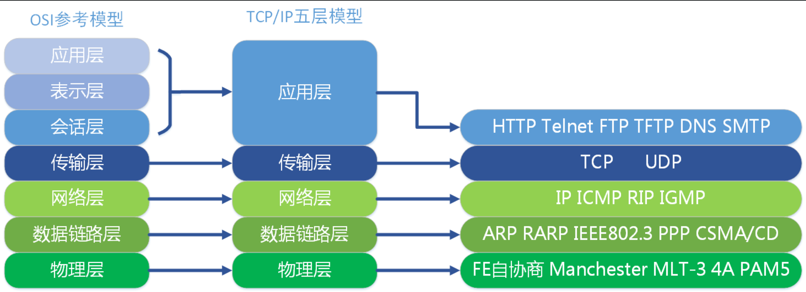
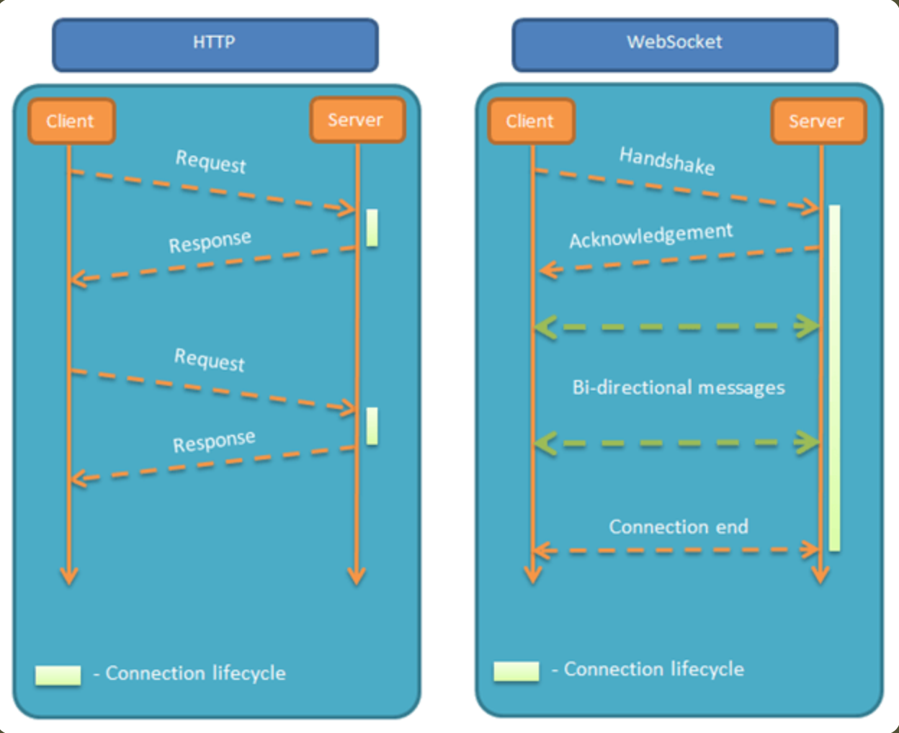
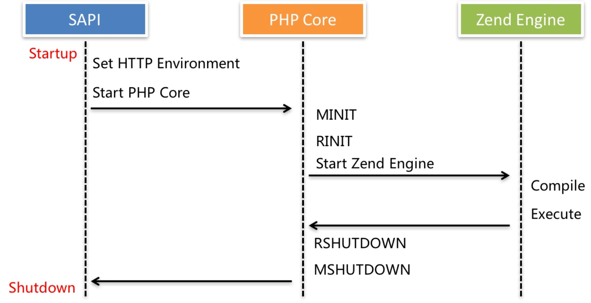
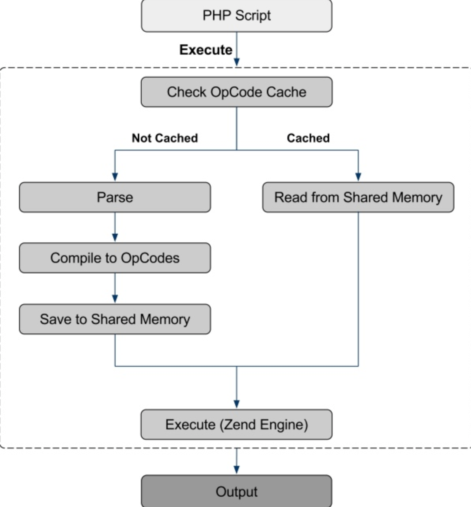

## 1.Websocket


### 1.OSI七层与TCP/IP五层模型




### 2.socket

```js
Socket实际上是对TCP/IP协议的封装，本身并不是协议，而是一个调用接口（API）.

Socket的出现只是使得程序员更方便地使用TCP/IP协议栈而已，是对TCP/IP协议的抽象，从而形成了我们知道的一些最基本的函数接口.

比如create、listen、connect、accept、send、read和write.
```


### 3.简介

```js
WebSocket 是一种网络通信协议.

WebSocket 协议在2008年诞生，2011年成为国际标准。所有浏览器都已经支持了.

服务器可以主动向客户端推送信息，客户端也可以主动向服务器发送信息，属于服务器推送技术的一种。

`长链接`

```

```js
# 服务器推送技术
1	Webpush
2	HTTP server push
3	Pushlet
4	Long polling
5	Flash XMLSocket relays
6	Reliable Group Data Delivery (RGDD)
7	Push notification
```


### 4.与HTTP的对比



### 5.特点

```js

（1）建立在 TCP 协议之上，服务器端的实现比较容易。

（2）与 HTTP 协议有着良好的兼容性。默认端口也是`80`和`443`，并且握手阶段采用 HTTP 协议，因此握手时不容易屏蔽，能通过各种 HTTP 代理服务器。

（3）数据格式比较轻量，性能开销小，通信高效。

（4）可以发送文本，也可以发送二进制数据。

（5）没有`同源限制`，客户端可以与任意服务器通信。

（6）协议标识符是`ws`（如果加密，则为wss），服务器网址就是 URL。   (scheme)
```

```js
ws://example.com:80/uri
wss://example.com:80/uri
```

### 6.示例

```js
# 客户端
let ws = new WebSocket("wss://echo.websocket.org");

ws.onopen = function(evt) { 
  console.log("Connection open ..."); 
  ws.send("Hello WebSockets!");
};

ws.onmessage = function(evt) {
  console.log( "Received Message: " + evt.data);
  ws.close();
};

ws.onclose = function(evt) {
  console.log("Connection closed.");
};

# 服务端
php -> socket_create(),  new Socket
python -> socket,
go -> gorilla/websocket
node -> socket.io / socket.io -client
```

```js
# 调试
https://jsbin.com/?js,console,output
```

```js
# webSocket.readyState
readyState属性返回实例对象的当前状态，共有四种。
CONNECTING：值为0，表示正在连接。
OPEN：值为1，表示连接成功，可以通信了。
CLOSING：值为2，表示连接正在关闭。
CLOSED：值为3，表示连接已经关闭，或者打开连接失败。
```


## 2.swoole

### 1.简介

```js
作者 韩天峰 
pecl开发组成员

php扩展

Swoole 是一个 PHP 的 `协程` `高性能` 网络通信引擎，使用 C/C++ 语言编写，提供了多种通信协议的网络服务器和客户端模块。可以方便快速的实现 TCP/UDP服务、高性能Web、WebSocket服务、物联网、实时通讯、游戏、微服务等，使 PHP 不再局限于传统的 Web 领域。

4.4+之后, 全面协程化, PHP 协程框架 
```

```js
# 文档
https://www.swoole.com/
```


php-fpm` 处理请求

`sapi`---> 初始化http的环境变量

`phpcore` ---> 初始化php拓展, 初始化上下文环境




`执行php脚本`




### 2.示例

#### 1.http server

```php
		$http = new Swoole\Http\Server("127.0.0.1", 9501);

    $http->on("start", function ($server) {
        echo "Swoole http server is started at http://127.0.0.1:9501\n";
    });

    $http->on("request", function ($request, $response) {
        $response->header("Content-Type", "text/plain");
        $response->end("Hello World\n");
    });

    $http->start();
```


#### 2.websocket server

```php
		$server = new Swoole\Websocket\Server("127.0.0.1", 9502);

    $server->on('open', function($server, $req) {
        echo "connection open: {$req->fd}\n";
    });

    $server->on('message', function($server, $frame) {
        echo "received message: {$frame->data}\n";
        $server->push($frame->fd, json_encode(["hello", "world"]));
    });

    $server->on('close', function($server, $fd) {
        echo "connection close: {$fd}\n";
    });

    $server->start();

```


#### 3.tcp server

```php
		$server = new Swoole\Server("127.0.0.1", 9503);
    $server->on('connect', function ($server, $fd){
        echo "connection open: {$fd}\n";
    });
    $server->on('receive', function ($server, $fd, $reactor_id, $data) {
        $server->send($fd, "Swoole: {$data}");
        $server->close($fd);
    });
    $server->on('close', function ($server, $fd) {
        echo "connection close: {$fd}\n";
    });
    $server->start();
```


#### 4.udp server

```php
		$serv = new Swoole\Server("127.0.0.1", 9502, SWOOLE_PROCESS, SWOOLE_SOCK_UDP);

    //监听数据接收事件
    $serv->on('Packet', function ($serv, $data, $clientInfo) {
        $serv->sendto($clientInfo['address'], $clientInfo['port'], "Server ".$data);
        var_dump($clientInfo);
    });

    //启动服务器
    $serv->start();
```

#### 5.task

```php
$server = new Swoole\Server("127.0.0.1", 9502);
    $server->set(array('task_worker_num' => 4));
    $server->on('receive', function($server, $fd, $reactor_id, $data) {
        $task_id = $server->task("Async");
        echo "Dispatch AsyncTask: [id=$task_id]\n";
    });
    $server->on('task', function ($server, $task_id, $reactor_id, $data) {
        echo "New AsyncTask[id=$task_id]\n";
        $server->finish("$data -> OK");
    });
    $server->on('finish', function ($server, $task_id, $data) {
        echo "AsyncTask[$task_id] finished: {$data}\n";
    });
    $server->start();
```


#### 6.coroutine

```php
//睡眠 1 万次，读取，写入，检查和删除文件 1 万次，使用 PDO 和 MySQLi 与数据库通信 1 万次，创建 TCP 服务器和多个客户端相互通信 1 万次，
//创建 UDP 服务器和多个客户端到相互通信 1 万次...... 一切都在一个进程一秒内完美完成！

   Swoole\Runtime::enableCoroutine();//此行代码后，文件操作，sleep，Mysqli，PDO，streams等都变成异步IO，见文档'一键协程化'章节
   $s = microtime(true);
    //Co/run()见文档'协程容器'章节
   Co\run(function() {
    // i just want to sleep...
    for ($c = 100; $c--;) {
        go(function () {
            for ($n = 100; $n--;) {
                usleep(1000);
            }
        });
    }

    // 10k file read and write
    for ($c = 100; $c--;) {
        go(function () use ($c) {
            $tmp_filename = "/tmp/test-{$c}.php";
            for ($n = 100; $n--;) {
                $self = file_get_contents(__FILE__);
                file_put_contents($tmp_filename, $self);
                assert(file_get_contents($tmp_filename) === $self);
            }
            unlink($tmp_filename);
        });
    }

    // 10k pdo and mysqli read
    for ($c = 50; $c--;) {
        go(function () {
            $pdo = new PDO('mysql:host=127.0.0.1;dbname=test;charset=utf8', 'root', 'root');
            $statement = $pdo->prepare('SELECT * FROM `user`');
            for ($n = 100; $n--;) {
                $statement->execute();
                assert(count($statement->fetchAll()) > 0);
            }
        });
    }
    for ($c = 50; $c--;) {
        go(function () {
            $mysqli = new Mysqli('127.0.0.1', 'root', 'root', 'test');
            $statement = $mysqli->prepare('SELECT `id` FROM `user`');
            for ($n = 100; $n--;) {
                $statement->bind_result($id);
                $statement->execute();
                $statement->fetch();
                assert($id > 0);
            }
        });
    }

    // php_stream tcp server & client with 12.8k requests in single process
    function tcp_pack(string $data): string
    {
        return pack('n', strlen($data)) . $data;
    }

    function tcp_length(string $head): int
    {
        return unpack('n', $head)[1];
    }

    go(function () {
        $ctx = stream_context_create(['socket' => ['so_reuseaddr' => true, 'backlog' => 128]]);
        $socket = stream_socket_server(
            'tcp://0.0.0.0:9502',
            $errno, $errstr, STREAM_SERVER_BIND | STREAM_SERVER_LISTEN, $ctx
        );
        if (!$socket) {
            echo "$errstr ($errno)\n";
        } else {
            $i = 0;
            while ($conn = stream_socket_accept($socket, 1)) {
                stream_set_timeout($conn, 5);
                for ($n = 100; $n--;) {
                    $data = fread($conn, tcp_length(fread($conn, 2)));
                    assert($data === "Hello Swoole Server #{$n}!");
                    fwrite($conn, tcp_pack("Hello Swoole Client #{$n}!"));
                }
                if (++$i === 128) {
                    fclose($socket);
                    break;
                }
            }
        }
    });
    for ($c = 128; $c--;) {
        go(function () {
            $fp = stream_socket_client("tcp://127.0.0.1:9502", $errno, $errstr, 1);
            if (!$fp) {
                echo "$errstr ($errno)\n";
            } else {
                stream_set_timeout($fp, 5);
                for ($n = 100; $n--;) {
                    fwrite($fp, tcp_pack("Hello Swoole Server #{$n}!"));
                    $data = fread($fp, tcp_length(fread($fp, 2)));
                    assert($data === "Hello Swoole Client #{$n}!");
                }
                fclose($fp);
            }
        });
    }

    // udp server & client with 12.8k requests in single process
    go(function () {
        $socket = new Swoole\Coroutine\Socket(AF_INET, SOCK_DGRAM, 0);
        $socket->bind('127.0.0.1', 9503);
        $client_map = [];
        for ($c = 128; $c--;) {
            for ($n = 0; $n < 100; $n++) {
                $recv = $socket->recvfrom($peer);
                $client_uid = "{$peer['address']}:{$peer['port']}";
                $id = $client_map[$client_uid] = ($client_map[$client_uid] ?? -1) + 1;
                assert($recv === "Client: Hello #{$id}!");
                $socket->sendto($peer['address'], $peer['port'], "Server: Hello #{$id}!");
            }
        }
        $socket->close();
    });
    for ($c = 128; $c--;) {
        go(function () {
            $fp = stream_socket_client("udp://127.0.0.1:9503", $errno, $errstr, 1);
            if (!$fp) {
                echo "$errstr ($errno)\n";
            } else {
                for ($n = 0; $n < 100; $n++) {
                    fwrite($fp, "Client: Hello #{$n}!");
                    $recv = fread($fp, 1024);
                    list($address, $port) = explode(':', (stream_socket_get_name($fp, true)));
                    assert($address === '127.0.0.1' && (int)$port === 9503);
                    assert($recv === "Server: Hello #{$n}!");
                }
                fclose($fp);
            }
        });
    }
  });
  echo 'use ' . (microtime(true) - $s) . ' s';
```


#### 7.Channel

```php
 Co\run(function(){
        //使用Channel进行协程间通讯
        $chan = new Swoole\Coroutine\Channel(1);
        Swoole\Coroutine::create(function () use ($chan) {
            for($i = 0; $i < 100000; $i++) {
                co::sleep(1.0);
                $chan->push(['rand' => rand(1000, 9999), 'index' => $i]);
                echo "$i\n";
            }
        });
        Swoole\Coroutine::create(function () use ($chan) {
            while(1) {
                $data = $chan->pop();
                var_dump($data);
            }
        });
  });
```


### 3.风格

`服务端` + `客户端`

#### 1.异步风格


#### 2.协程风格

`进程`   --->  `线程`  --->   `协程`	

 `连接池` (server的manager模块)

 

```js
# 创建
`Coroutine::create` 或 `go` 方法创建协程

支持 `waitgroup`
```


```js
# 通信问题
	 进程
			 高性能共享内存 `Table`
       `Process`模块 (代替php自带的 `pcntl` )
   协程
       `Coroutine\Channel`
    	并发编程: Coroutine::create() + setdefer()  ->   go() + channel


退出协程`exit`禁用
`异常捕获`不能跨协程
在多个协程间不能`共用`一个连接
禁止使用`静态类`或者`全局变量`保存上下文对象
`sleep`不能用
```


### 4.基本须知

#### 1.四种设置回调函数的方式

```js
# 匿名函数
$server->on('Request', function ($req, $resp) use ($a, $b, $c) {
    echo "hello world";
});
Copy to clipboardErrorCopied
可使用 use 向匿名函数传递参数
```

```js
# 类静态方法
class A
{
    static function test($req, $resp)
    {
        echo "hello world";
    }
}
$server->on('Request', 'A::Test');
$server->on('Request', array('A', 'Test'));
Copy to clipboardErrorCopied
对应的静态方法必须为 public
```

```js
# 函数
function my_onRequest($req, $resp)
{
    echo "hello world";
}
$server->on('Request', 'my_onRequest');

```

```js
# 对象方法
class A
{
    function test($req, $resp)
    {
        echo "hello world";
    }
}
$object = new A();
$server->on('Request', array($object, 'test'));
对应的方法必须为 public
```


#### 2.同步 IO / 异步 IO

```js
# 网络io模型:
同步模型（synchronous IO）
阻塞IO（bloking IO）
非阻塞IO（non-blocking IO）
多路复用IO（multiplexing IO） `poll/select`  -> `epoll`
信号驱动式IO（signal-driven IO）
异步IO（asynchronous IO）
```


#### 3.EventLoop

```js
所谓 EventLoop，即事件循环，可以简单的理解为 `epoll_wait`，我们会把所有要发生事件的句柄（fd）加入到 epoll_wait 中，这些事件包括可读，可写，出错等。 我们的进程就阻塞在 epoll_wait 这个内核函数上，当发生了事件 (或超时) 后 epoll_wait 这个函数就会结束阻塞返回结果，就可以回调相应的 PHP 函数，例如，收到客户端发来的数据，回调 OnRecieve 回调函数。

当有大量的 fd 放入到了 epoll_wait 中，并且同时产生了大量的事件，epoll_wait 函数返回的时候我们就会挨个调用相应的回调函数，叫做一轮事件循环，即 IO 多路复用，然后再次阻塞调用 epoll_wait 进行下一轮事件循环。
```


#### 4.TCP粘包问题

```js
tcp 封包 解包 粘包 
数据封包协议规定：整个数据包包含2字节长度信息+数据包体。2字节长度信息包含本身着2字节。
如：数据体是（abcdefg）7个字节，整体封包就是09abcdefg，总共是9个字节的协议
```

```js
EOF 结束符协议
固定包头 + 包体协议
```


#### 5.IPC

```js
同一台主机上两个进程间通信 (`Inter-Process Communication`)
```

```js
在 Swoole 下使用了 2 种方式 :

# Unix Socket :
全名 UNIX Domain Socket, 简称 UDS
SOCK_STREAM : 数据大用 (有粘包问题)
SOCK_DGRAM : 数据小用 (64k)

# sysvmsg :
Linux 提供的消息队列，这种 IPC 方式通过一个文件名来作为 key 进行通讯，这种方式非常的不灵活，实际项目使用的并不多
```


### 5.安装

`扩展冲突`

```js
xdebug
phptrace
aop
molten
xhprof
phalcon（Swoole 协程无法运行在 phalcon 框架中）
```

`必须`

```js
php-7.1 或更高版本
gcc-4.8 或更高版本
make
autoconf
```

#### 1.源码安装

```js
#1. 下载 swoole 源码
https://github.com/swoole/swoole-src/releases
http://pecl.php.net/package/swoole
http://git.oschina.net/swoole/swoole

#2. 从源码编译安装
下载源代码包后，在终端进入源码目录，执行下面的命令进行编译和安装
cd swoole-src && \
phpize && \
./configure && \
--enable-openssl  \
--enable-http2 && \
make && sudo make install

#3. 启用扩展
编译安装到系统成功后，需要在 php.ini 中加入一行 extension=swoole.so 来启用 Swoole 扩展
```


#### 2.pecl安装

```js
pecl install swoole
```


## 3.swoft

`version:2.x`

### 1.环境准备

```js
#必要部分
PHP，版本 >=7.1
PHP 包管理器 Composer
PCRE 库
PHP 扩展 Swoole，版本 >=4.3
额外扩展：PDO、Redis

#冲突部分
Xdebug
Xhprof
Blackfire
Zend
trace
Uopz
```


### 2.安装方式

#### 1.docker

```js
docker run -p 18306:18306 --name swoft swoft/swoft
```


#### 2.docker-compose

```js
git clone https://github.com/swoft-cloud/swoft
cd swoft
docker-compose up

# sserver下面有以下文件配置
docker-compose.yml
docker-sync -> rsync , native_osx
```


#### 3.composer

```js
composer create-project swoft/swoft Swoft
```


#### 4.手动安装

```js
git clone https://github.com/swoft-cloud/swoft
cd swoft
composer install
cp .env.example .env
```


#### 5.swoftcli

```js
# 支持从不同模板项目中快速创建一个干净的 Swoft 应用
php swoftcli.phar create:app --type full Swoft-Full
php swoftcli.phar create:app --type ws Swoft-WebSocket
php swoftcli.phar create:app --type tcp Swoft-TCP

# 使用
cp swoftcli.phar /usr/local/bin/swoftcli && chmod a+x swoftcli
```


### 3.目录结构

```js
├── app/    ----- 应用代码目录
│   ├── Annotation/        ----- 定义注解相关   (`ReflectionCalss`)
│   ├── Aspect/            ----- AOP 切面      (`Aspect-oriented programming`)
│   ├── Common/            ----- 一些具有独立功能的 class bean
│   ├── Console/           ----- 命令行代码目录
│   ├── Exception/         ----- 定义异常类目录
│   │   └── Handler/           ----- 定义异常处理类目录
│   ├── Http/              ----- HTTP 服务代码目录
│   │   ├── Controller/
│   │   └── Middleware/
│   ├── Helper/            ----- 助手函数
│   ├── Listener/          ----- 事件监听器目录
│   ├── Model/             ----- 模型、逻辑等代码目录(这些层并不限定，根据需要使用)
│   │   ├── Dao/
│   │   ├── Data/
│   │   ├── Logic/
│   │   └── Entity/
│   ├── Rpc/               ----- RPC 服务代码目录
│   │   └── Service/
│   │   └── Middleware/
│   ├── WebSocket/         ----- WebSocket 服务代码目录
│   │   ├── Chat/
│   │   ├── Middleware/
│   │   └── ChatModule.php
│   ├── Tcp/               ----- TCP 服务代码目录
│   │   └── Controller/        ----- TCP 服务处理控制器目录
│   ├── Application.php    ----- 应用类文件继承自swoft核心
│   ├── AutoLoader.php     ----- 项目扫描等信息(应用本身也算是一个组件)
│   └── bean.php
├── bin/
│   ├── bootstrap.php
│   └── swoft              ----- Swoft 入口文件
├── config/                ----- 应用配置目录
│   ├── base.php               ----- 基础配置
│   └── db.php                 ----- 数据库配置
├── public/                ----- 公共目录
├── resource/              ----- 应用资源目录
│   ├── language/              ----- 语言资源目录  
│   └── view/                  ----- 视图资源目录  
├── runtime/               ----- 临时文件目录（日志、上传文件、文件缓存等）
├── test/                  ----- 单元测试目录
│   └── bootstrap.php
├── composer.json
├── phar.build.inc
└── phpunit.xml.dist
```


### 4.运行服务

```js
如果在 .env 文件中开启了调试 SWOFT_DEBUG=1 将会在控制台中显示更多详细的信息。
```


#### 1.http server

```js
# 启动 HTTP 服务
$ php ./bin/swoft http:start

# 以守护进程模式启动
$ php ./bin/swoft http:start -d

# 重启 HTTP 服务
$ php ./bin/swoft http:restart

# 重新加载 HTTP 服务
$ php ./bin/swoft http:reload

# 停止 HTTP 服务
$ php ./bin/swoft http:stop

# swoftcli
swoftcli -h
swoftcli run -c ws:start
swoftcli run -c http:start
```


#### 2.websocket server

```js
# 启动 WS 服务
$ php ./bin/swoft ws:start

# 以守护进程模式启动
$ php ./bin/swoft ws:start -d

# 重启 WS 服务
$ php ./bin/swoft ws:restart

# 重新加载 WS 服务
$ php ./bin/swoft ws:reload

# 关闭 WS 服务
$ php ./bin/swoft ws:stop
```


#### 3.rpc server

```js
# 启动 RPC 服务
$ php ./bin/swoft rpc:start

# 以守护进程模式启动
$ php ./bin/swoft rpc:start -d

# 重启 RPC 服务
$ php ./bin/swoft rpc:restart

# 重新加载 RPC 服务
$ php ./bin/swoft rpc:reload

# 关闭 RPC 服务
$ php ./bin/swoft rpc:stop
```


### 5.注解

```php
use Swoft\Http\Message\Request;
use Swoft\Http\Server\Annotation\Mapping\Controller;
use Swoft\Http\Server\Annotation\Mapping\RequestMapping;

/**
 * Class Home
 *
 * @Controller(prefix="home")
 */
class Home
{
    /**
     * 该方法路由地址为 /home/index
     *
     * @RequestMapping(route="/index", method="post")
     *
     * @param Request $request
     */
    public function index(Request $request)
    {
        // TODO:
    }
}
```


### 6.IoC - DI

```js
IoC: Inversion of Control
```

```js
DI: Dependency Injection
```


`Bean容器`

```js
# 定义
@Bean
命名空间：\Swoft\Bean\Annotation\Bean

name 定义 Bean 别名，缺省默认类名
scope 注入 Bean 类型，默认单例，Scope::SINGLETON/Scope::PROTOTYPE(每次创建)
ref 指定引用 Bean ，用于定义在接口上面，指定使用哪个接口实现。
```

```js
# 注入
@Inject
命名空间：\Swoft\Bean\Annotation\Inject

name 定义属性注入的bean名称，缺省属性自动类型名称
```

```js
# 操作
App::getBean("name");
ApplicationContext::getBean('name');
BeanFactory::getBean('name');
BeanFactory::hasBean("name");
```

