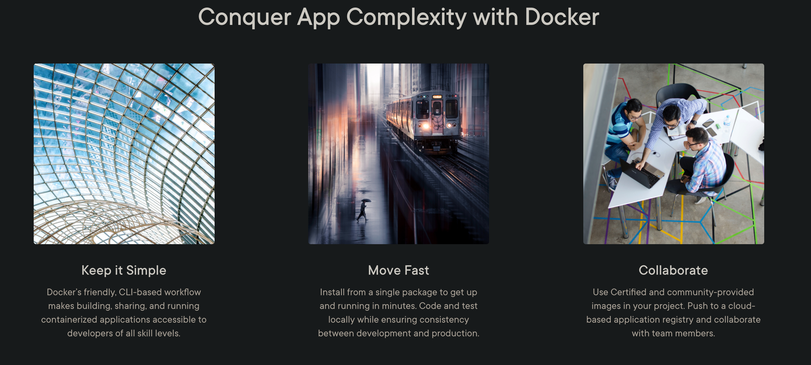
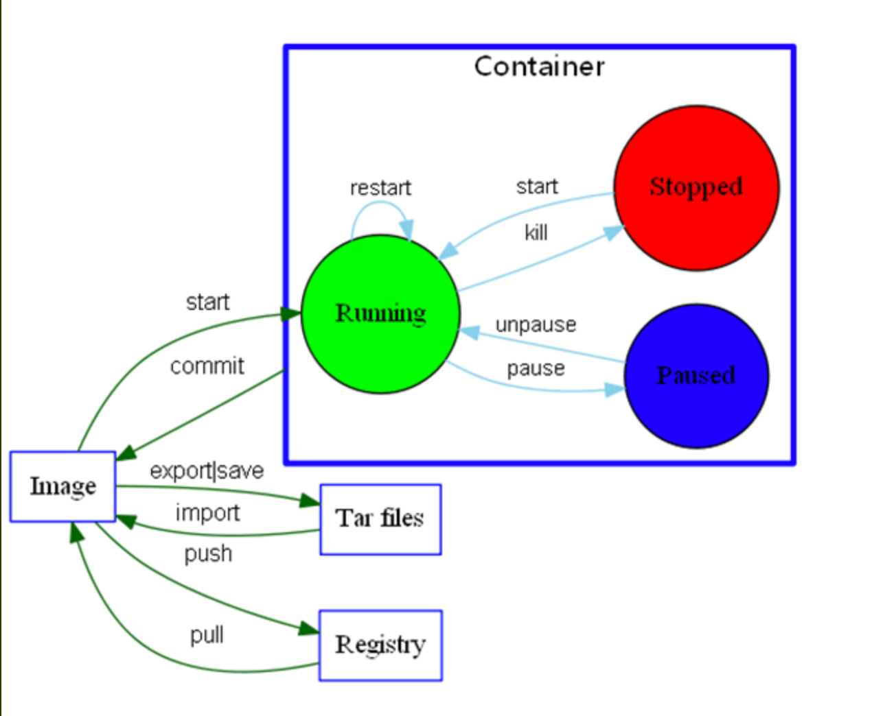
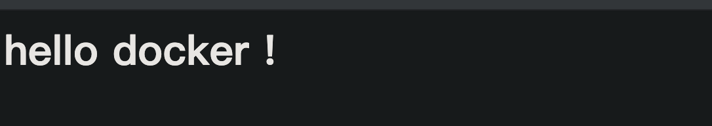

## 1、why docker ?



<!--truncate-->


## 2、about

`repository`、`image`、`container`、`tag`




## 3、how to use ? 

### 1) command

```js
# 以守护进程模式启动Docker
sudo service docker start

# 设置开机自动启动Docker
systemctl start docker

# 查看版本
docker version

```

```js
# 拉取镜像 
docker pull name:tag
docker pull nginx
docker pull busybox
docker pull python:2.7

# 查看镜像
docker images

# 删除镜像
docker rmi id

# 查看容器 运行中
docker ps

docker ps -a 

# 查看网络 (namespace,veth pair)
docker network ls
{ bridge, host, none, overlay}

```

```js
# docker run 启动容器
-d 后台运行
--name 指定容器名称
-p 80:80 端口映射
-v /root:/root 目录映射
--link 链接容器
--nwtwork 指定网络
-c 添加运行时cmd 命令
-e 添加环境变量
 
# docker exec name -it 
-it	交互模式进入容器
-i --interactive
-t --tty 	

```

### 2) example

```linux
-- 启动nginx容器
docker run -it --name web-n1 -p 80:80 -v /var/www/html:/usr/share/nginx/html -d nginx:alpine
```



```js
-- 启动redis
docker run -d --name rds -p 6379:6379 redis
```


```js
-- 链接容器
docker run -d --link rds --name app-1 -e REDIS_HOST=rds app:1.0
```


### 3) dockerfile

```dockerfile
dokcerfile构建:
FROM  : 来源基础镜像 (scratch -> 所有镜像原始镜像)
MAINTAINER :  作者<邮箱>
RUN : 容器构建需要执行的命令 (创建用户组 , 创建文件夹 , 安装包 等)
RUN yum -y install vim 
RUN yum -y install net-tools
RUN mkdir /var/wwwroot 
建议如下使用 , 使用 & 连接 : 
RUN yum -y install vim \
&& yum -y install net-tools \
&& mkdir /var/wwwroot 

EXPOSE : 暴露的端口号
WORKDIR : 指定在创建并且进去容器终端后的工作目录(无指定到 / 根目录)
ENV : 构建镜像过程中设置的环境变量 
ENV MY_PATH /var/wwwroot
WORKDIR $MY_PATH

ADD : 将宿主机目录下的文件拷贝进镜像 , 并且会自动处理url和解压tar压缩包
COPY : 类似add , 拷贝到镜像, 没有处理功能
VALUME : 容器数据卷, 用于数据持久化 , 容器中创建指定的目录
CMD : 指定容器启动时运行的命令 ( 多个命令只有最后一个生效 , 会被docker run之后的参数覆盖)
ENTRYPOINT : 与cmd功能一样 , 会在docker run之后的参数追加命令
ONBUILD : 当构建一个被继承的dockerfile时运行命令,父镜像在被子镜像继承后父镜像的onbuild被触发
```

 ```dockerfile
FROM python:3.7

COPY . /var/www/app
WORKDIR /var/www/app
RUN pip install flask redis
EXPOSE 80
CMD [ "python","app.py" ]
 ```

```python
from flask import Flask
from redis import Redis
import os
import socket

app = Flask(__name__)

redis = Redis(host=os.environ.get('REDIS_HOST','127.0.0.1'),prot=6379)

@app.route("/")
def incr():
  redis.incr('like')
  return 'current like = %s, current host = %s \n' % (redis.get('like'),socket.gethostname())

if __name__ == "__main__":
  app.run(host="0.0.0.0",port=80,debug=True)
```

``` js
# 使用dockerfile构建镜像
docker build -t name:tag -f template .
docker build -t app-1:1.0 .

# 运行构建镜像
docker run -d --link rds-1 --name app-5 -p 80:80 -e REDIS_HOST=rds-1 app-1:3.0

# 进入容器
docker exec -it app-5 bash
curl 0.0.0.0:80
--> current like = b'1', current host = bc33562a73ea
--> current like = b'2', current host = bc33562a73ea
--> current like = b'3', current host = bc33562a73ea


```


### 4) cluster example

`etcd + docker`

 `overlay network`

```js
/usr/bin/dockerd -H tcp://0.0.0.02375 -H unix:///var/run/docker.sock --cluster-store=etcd://192.168.xxx.xx:2379 --cluster-advertise=192.168.xxx.xx1:2375&

/usr/bin/dockerd -H tcp://0.0.0.02375 -H unix:///var/run/docker.sock --cluster-store=etcd://192.168.xxx.xx:2379 --cluster-advertise=192.168.xxx.xx2:2375&
```


## 4、docker-compose

### 1) config yml

`docker-compose.yml`

```docker-compose
version: "3"

services: 
  rds:
    image: redis
  app:
    build: 
      context: .
      dockerfile: Dockerfile
      ports: 
        - 80:80
        environment: 
          REDIS_HOST: rds
          

```

###  2) scale

`--scale`

`docker-compose up --scale app=3 -d`

```docker-compose
version: '3'

services:
  rds:
    image: redis

  app:
    build:
      context: .
      dockerfile: Dockerfile
    # ports:
    # - 80:80
    environment:
      REDIS_HOST: rds

  lib:
    image: dockercloud/haproxy
    links:
      - app
    ports:
      - 80:80
    volumes:
      - /var/run/docker.sock:/var/run/docker.sock

```

### 3) command

```js
cd ~/path
docker-compose up -d
docker-compose stop
docker-compose restart
docker-compose down
docker-compose build

```


### 4) cluster

```js
k8s, swarm
```