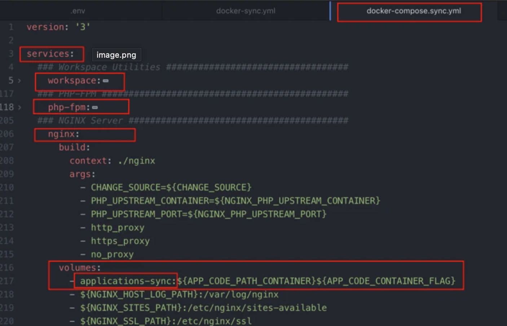
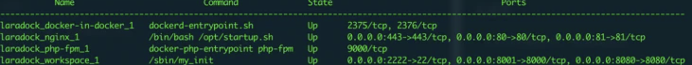

基于Docker快速搭建nginx+redis+mysql+php
# Laradock

## 1.官网地址
```
 # laradock 英文地址
 https://laradock.io/
 
 # laradock 中文文档
 https://laradock-docs.linganmin.cn/zh/documentation/
 
 # docker-sync
 https://docker-sync.readthedocs.io/en/latest/
```

<!--truncate-->

## 2.安装准备
```
*   [Git](https://git-scm.com/downloads)
*   [Docker](https://www.docker.com/products/docker/)`>= 17.12
```

## 3.目录结构
```
// 官网有多种目录格式,个人喜欢使用一个laradock当做入口即可
+ laradock  
+ project-1  
+ project-2
```

## 4.安装
```bash
git clone https://github.com/laradock/laradock.git
```

## 5.配置
### 1.创建配置文件
```
 cp env-example .env
```
### 2.配置环境选项

```
// 第一步(重要),修改为阿里源 (官方的php Dockerfile也吐槽了这个...)
CHANGE_SOURCE=true
```

`容器环境配置`
```
// workspace 宿主机挂载目录
APP_CODE_PATH_HOST=../

// 容器目录
APP_CODE_PATH_CONTAINER=/var/www
```

```
// 时区
WORKSPACE_TIMEZONE=PRC
```

`PHP 配置`
```
// php版本可选: 7.4 - 7.3 - 7.2 - 7.1 - 7.0 - 5.6
PHP_VERSION=7.3

// 网络原因这个扩展可能会导致安装失败,建议修改为false
WORKSPACE_INSTALL_IMAGEMAGICK=false
PHP_FPM_INSTALL_IMAGEMAGICK=false
```

`NGINX 配置`
```
NGINX_HOST_HTTP_PORT=80     // http 监听端口
NGINX_HOST_HTTPS_PORT=443   // https 监听端口
NGINX_HOST_LOG_PATH=./logs/nginx/  // nginx 内容器日志目录
NGINX_SITES_PATH=./nginx/sites/     // nginx 配置文件目录
NGINX_PHP_UPSTREAM_CONTAINER=php-fpm    // 绑定 php-fpm 处理
NGINX_PHP_UPSTREAM_PORT=9000    // php-fpm 端口
NGINX_SSL_PATH=./nginx/ssl/     // nginx ssl路径
```

`APACHE 配置 (同上nginx)`
```
APACHE_HOST_HTTP_PORT=80
APACHE_HOST_HTTPS_PORT=443
APACHE_HOST_LOG_PATH=./logs/apache2
APACHE_SITES_PATH=./apache2/sites
APACHE_PHP_UPSTREAM_CONTAINER=php-fpm
APACHE_PHP_UPSTREAM_PORT=9000
APACHE_PHP_UPSTREAM_TIMEOUT=60
APACHE_DOCUMENT_ROOT=/var/www/
```

`MYSQL 配置`
```
MYSQL_VERSION=5.7   // 版本 , latest为最新版
MYSQL_DATABASE=default  // 默认创建的数据库名称
MYSQL_USER=root // 用户名
MYSQL_PASSWORD=root // 密码
MYSQL_PORT=3306 // 监听端口
MYSQL_ROOT_PASSWORD=root    // root用户的密码
MYSQL_ENTRYPOINT_INITDB=./mysql/docker-entrypoint-initdb.d
```

`REDIS 配置`
```
REDIS_PORT=6379

# 默认redis是没有密码的, 如果要添加密码

// 1-仅修改密码,需要修改docker-compose.yml编排文件
redis:
      build: ./redis
      volumes:
        - ${DATA_PATH_HOST}/redis:/data
      # 添加这一行为redis设置密码
      command: redis-server --requirepass your_password
      ports:
        - "${REDIS_PORT}:6379"
      networks:
        - backend
        
// 2-直接添加redis的配置文件,修改redis的Dockerfile
1.  注释 `bind 127.0.0.1`  // 绑定本机ip
2.  `protected-mode` 改为 `no` // 只允许本机访问
3.  `requirepass your_password` // 添加你的密码
```

```
// 其它类似配置可在.env中查找,例如:
Memcached,RabbitMQ,phpMyAdmin,ElasticSearch,Varnish,HAProxy,Jenkins,Gitlab,tomcat等
```
### 3.配置docker-sync(可选)
```
# 注: 此项为可选项 , 用于 mac/windows 加速宿主机和容器的文件同步速度

# 步骤一 (.env中修改)
// 选择加载的docker-compose编排文件,如果需要使用docker-sync,则在最后面加上":docker-compose.sync.yml"
COMPOSE_FILE=docker-compose.yml

// 可以配置文件同步策略,mac->native_osx,windows->unison
DOCKER_SYNC_STRATEGY=native_osx

# 步骤二 (docker-compose.sync.yml中修改)
// 添加你需要启动的service , 如果包含APP_CODE_PATH_HOST变量映射目录,修改映射宿主目录为 "applications-sync" , 注意缩进
```


## 6.启动
```
# 每次修改配置文件, 需要重新build

// 先build,再启动
cd laradock
docker-compose build nginx redis mysql php-fpm workspace
docker-compose up -d nginx mysql redis


// 直接启动 , 会自动build拉取
docker-compose up -d nginx mysql redis php-fpm workspace

```

## 7.常用指令
```
// 查看运行状态 "State" => "up" 即为启动成功 
docker-compose ps
```


```
# 重启 / 关闭 / 删除
docker-compose restart / stop / down
```

```
// 进入工作容器
docker-compose exec workspace bash
```

## 8.配置nginx访问服务
```
// nginx 主配置文件已经包含了 `your_path/laradock/nginx/sites` 目录下的 `*.conf` 文件
cp laravel.conf.example laravel.conf

// 下面是一份nginx server的配置部分内容
server {
    
    listen 80;
    listen [::]:80;

    # For https
    # listen 443 ssl;
    # listen [::]:443 ssl ipv6only=on;
    # ssl_certificate /etc/nginx/ssl/default.crt;
    # ssl_certificate_key /etc/nginx/ssl/default.key;

    # 修改你的域名或者ip , 本机开发可在 `/etc/hosts` 中修改映射关系
    server_name test.cc;
    
    # 修改你的项目路径
    root /var/www/public;
    index index.php index.html index.htm;

    location / {
         try_files $uri $uri/ /index.php$is_args$args;
    }
    
    ...
    ...
    ...
    
    # 修改你的日志文件
    error_log /var/log/nginx/laravel_error.log;     
    access_log /var/log/nginx/laravel_access.log;
}

// 在 `your_path/laradock` 同级目录下
mkdir public
chmod -R 755 ./public
echo -e "<?php \n\r phpinfo();" >> ./public/index.php

// nginx 修改了配置文件需要重启 , 这里我们直接重启容器 , 就不麻烦进入nginx 容器去重启 nginx
docker-compose restart

// 浏览器输入 "test.cc" , 此时能看见 phpinfo 输入的信息则表示配置成功
```

## 9.结束语
`Use Docker First - Then Learn About It Later` [#](https://laradock.io/introduction/#use-docker-first-then-learn-about-it-later-q "Permanent link")

**这是`laradock`官网介绍上的一句话**

**以上, 就是基于laradock搭建php+nginx+mysql+redis环境的内容了!**