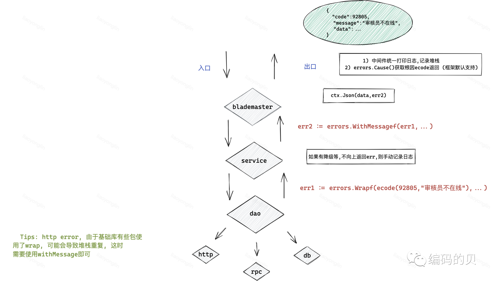
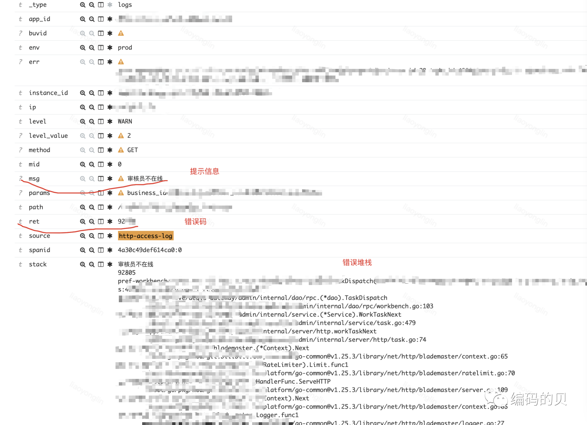

# 错误处理工程化实践


## 1) 背景
&ensp;&ensp;&ensp;&ensp;不熟悉代码的情况下, 拿到一个错误排查, 无法串起来整个代码的调用链路, 错误产生堆栈, 排查困难、缓慢, 根据trace只能看见服务调用链

<!--truncate-->

## 2) 现状
### 1) 重复处理

```go
// 重复: 逐层返回错误, 各层记录日志

func foo() error{
    return errors.New("foo")
}
 
func bar() error{
 
    err := foo()
 
    if err != nil {
 
        log.Error(err)
 
        return err    // handle error once, 应该记日志或者返回
 
    }
 
    return nil
}
 
func handle() error {
 
    err := bar()
 
    if err != nil {
 
        log.Error(err)
 
        return err    // handle error once, 应该记日志或者返回
 
    }
 
    return nil
}
```

### 2) 没有堆栈


```go
// 没有错误链(堆栈): 当错误到达应用上层, 不好跟踪根源

func foo() error {
 
    return errors.New("foo")
 
}
 
func test() error{
 
    err := foo()
 
    if err != nil {
 
        log.Error(err)
 
        return err
 
    }
 
    return nil
}
 
func main(){
 
    err := test()
 
    if err := nil {
 
        fmt.Println("%+v",err)    // foo, 没有从main->test->foo的堆栈

    }
}
```

## 3) 如何处理错误
### 1) 目标
- 错误被日志记录, 不重复记录
- 上层应用处理错误, 保重100%的完整性
- 可以添加上下文信息

### 2) 方法
["github.com/pkg/errors"](https://pkg.go.dev/github.com/pkg/errors@v0.9.1#pkg-functions)

 - `errors.Wrapf()`: Wrapf returns an error annotating err with a stack trace (带有堆栈, 重复会有多次堆栈)
 - `errors.WithMessagef()`: WithMessagef annotates err with the format specifier (不带堆栈, 可携带信息)

### 3) 最佳实践
- 最底层(比如公共库)返回原始错误, 无需wrap
- 应用下层流转错误, 使用wrap带上堆栈
- 应用内方法互相调用, 避免重复wrap导致重复堆栈, withMessage携带信息即可




### 4) 效果
在打印或者记录错误, 一般由日志中间件在最上层完成, 使用占位符 `%+v`, 比如
```go
// log error with stack

fmt.Printf("err:%+v", err)
```




## 4) Q&A

#### 1) ecode为自定义错误信息结构体, 是否会改变前端提示?

前端能够正确展示对应的提示是基于返回的ecode中的code和message, 前端展示message信息。

- wrap之前: 应用返回原始error(即为根因error), 如果该error为ecode, 拥有对应的code和message, 则前端能正常展示, 否则则不能

- wrap之后: 应用层通用返回原始error(即为根因error), wrap加上堆栈, 出口处框架会自动cause寻找根因, 之后和wrap之前逻辑一致

也就是说, 重点在于返回的原始error是否为ecode才是重点, 与是否wrap没有关系

<br></br>

#### 2) 每一层error向上抛时如何携带上下文信息?

pkg/errors 包提供了以下方法

- errors.Wrap(),

- errors.Wrapf(), 

- errors.WithMessage(), 

- errors.WithMessagef()

使用注意事项
- `Wrap`类会携带堆栈, 应用下层调用一次即可, 避免多次调用造成堆栈多次打印
- `WithMessage`类不会携带堆栈, 只会包装一层
- 带`f`类占位符的函数, 可以携带一些参数等上下文信息

## 5) references
- [go-exceptions](https://golang.org/doc/faq#exceptions)
- [why-go-error-handling-is-awesome](https://rauljordan.com/2020/07/06/why-go-error-handling-is-awesome.html)
- [stack-traces-and-the-errors](https://dave.cheney.net/2016/06/12/stack-traces-and-the-errors-package)