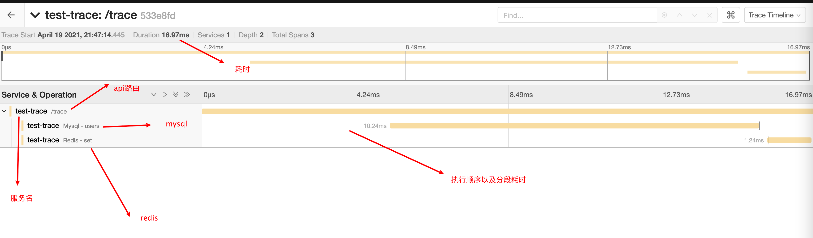

## 一、前言

​		上文介绍了 `trace` 的 由来, 以及简单应用, 今天我们就来实际用代码操作一下, 看看到底如何简单, 方便的在项目中接入 `trace`

​		一般我们会采用中间件的方式在web库中接入, 各大主流的web库(如`gin`,`iris`)都有自己的中间件方式, 整体上都是大同小异的, 由于作者的项目中使用的是`iris`库, 今天我们采用 `iris` 来进行demo演示

<!--truncate-->


## 二、准备

1、`iris`  [https://github.com/kataras/iris]

2、`redis`  [https://github.com/go-redis/redis]

3、`gorm` [https://github.com/go-gorm/gorm]


## 三、实现

​		实现的原理其实也很简单, 主要是通过 `golang` 的内置包 `context`进行变量传递, 再不通过的调用处都开启一个新的 `span`, 最终所有的span都连接起来, 就是实现了我们的整个链路了, 其实 `rpc` 的调用通用可以加上去

​		原理弄清楚之后, 就要开始写代码了, 那么怎么在`redis`也好, `gorm`也好, 我们传入`context`的时候, 程序就会帮我们自动处理生成`trace`呢?

​		这个时候就需要我们去做一些面向切面的东西, `gorm`里面我们可以实现一个插件来做, `redis`这个也有同样的实现

​		

### 1) gorm 插件:

gorm中的插件定义是为`interface`

```go
type Plugin interface {
    Name() string
    Initialize(*DB) error
}
Plugin GORM plugin interface
```

我们只需要实现这个 `interface` 即可使用:

```go
import (
	"fmt"
	"github.com/opentracing/opentracing-go"
	"github.com/opentracing/opentracing-go/ext"
	tracerLog "github.com/opentracing/opentracing-go/log"
	"gorm.io/driver/mysql"
	"gorm.io/gorm"
	"strings"
)

const (
	callBackBeforeName = "opentracing:before"
	callBackAfterName  = "opentracing:after"
)

type OpenTracingPlugin struct{}

var _ gorm.Plugin = &OpenTracingPlugin{}

func (op *OpenTracingPlugin) Name() string {
	return "openTracingPlugin"
}

func (op *OpenTracingPlugin) Initialize(db *gorm.DB) (err error) {
	// 开始前 - 并不是都用相同的方法，可以自己自定义
	db.Callback().Create().Before("gorm:before_create").Register(callBackBeforeName, before)
	db.Callback().Query().Before("gorm:query").Register(callBackBeforeName, before)
	db.Callback().Delete().Before("gorm:before_delete").Register(callBackBeforeName, before)
	db.Callback().Update().Before("gorm:setup_reflect_value").Register(callBackBeforeName, before)
	db.Callback().Row().Before("gorm:row").Register(callBackBeforeName, before)
	db.Callback().Raw().Before("gorm:raw").Register(callBackBeforeName, before)

	// 结束后 - 并不是都用相同的方法，可以自己自定义
	db.Callback().Create().After("gorm:after_create").Register(callBackAfterName, after)
	db.Callback().Query().After("gorm:after_query").Register(callBackAfterName, after)
	db.Callback().Delete().After("gorm:after_delete").Register(callBackAfterName, after)
	db.Callback().Update().After("gorm:after_update").Register(callBackAfterName, after)
	db.Callback().Row().After("gorm:row").Register(callBackAfterName, after)
	db.Callback().Raw().After("gorm:raw").Register(callBackAfterName, after)
	return
}

// do logic
const _GormSpan = "_GormSpan"

func before(db *gorm.DB) {

	if !opentracing.IsGlobalTracerRegistered() {
		return
	}

	operationName := fmt.Sprintf("Mysql - %s", db.Statement.Schema.Table)

	span, _ := opentracing.StartSpanFromContext(db.Statement.Context, operationName)

	span.SetTag(string(ext.DBType), "sql")
	span.SetTag("db.table", db.Statement.Schema.Table)

	a, ok := db.Statement.Config.Dialector.(*mysql.Dialector)
	if ok {
		index := strings.Index(a.DSN, "tcp(")
		span.SetTag(string(ext.DBInstance), a.DSN[index:])
	}

	// 记录当前span
	db.InstanceSet(_GormSpan, span)

}

func after(db *gorm.DB) {

	_span, isExist := db.InstanceGet(_GormSpan)
	if !isExist {
		return
	}

	span, ok := _span.(opentracing.Span)
	if !ok {
		return
	}

	defer span.Finish()

	// Error
	if db.Error != nil {
		ext.Error.Set(span, true)
		span.LogFields(tracerLog.Error(db.Error))
	}

  // 记录sql
	span.SetTag(string(ext.DBStatement), db.Dialector.Explain(db.Statement.SQL.String(), db.Statement.Vars...))
	span.LogFields(tracerLog.String("sql", db.Dialector.Explain(db.Statement.SQL.String(), db.Statement.Vars...)))
  
  // 记录影响行数
	span.SetTag("db.count", db.RowsAffected)
  
  // 截取 sql 表示记录方法
	span.SetTag("db.method", strings.ToUpper(strings.Split(db.Statement.SQL.String(), " ")[0]))

}
```

如何使用 ?

```go
// 实例化gorm db后, 直接调用 use 方法进行插件使用
_db.Use(&OpenTracingPlugin{})
```


​	

### 2) redis hook

在我们使用的 `redis`包中, 上述功能叫做`hook`, 其实`hook`的定义同样为一个`interface`:

```go
type Hook interface {
    BeforeProcess(ctx context.Context, cmd Cmder) (context.Context, error)
    AfterProcess(ctx context.Context, cmd Cmder) error
    BeforeProcessPipeline(ctx context.Context, cmds []Cmder) (context.Context, error)
    AfterProcessPipeline(ctx context.Context, cmds []Cmder) error
}
```

同理, 我们来实现这个 `interface`:

```go
import (
	"context"
	"fmt"
	"github.com/go-redis/redis/v8"
	"github.com/opentracing/opentracing-go"
	"github.com/opentracing/opentracing-go/ext"
	tracerLog "github.com/opentracing/opentracing-go/log"
	"github.com/pkg/errors"
)

type TracingHook struct{}

type RedisSpanKey string

const _RedisSpan RedisSpanKey = "_RedisSpan"

var _ redis.Hook = TracingHook{}

func (TracingHook) BeforeProcess(ctx context.Context, cmd redis.Cmder) (context.Context, error) {

	if !opentracing.IsGlobalTracerRegistered() {
		return ctx, nil
	}

	operationName := fmt.Sprintf("Redis - %s", cmd.Name())
	span, _ := opentracing.StartSpanFromContext(ctx, operationName)

	span.SetTag(string(ext.DBType), "redis")
	span.SetTag("redis.name", cmd.Name())
	span.SetTag("redis.full_name", cmd.FullName())
	span.LogKV("redis.cmd", cmd.String(), "redis.args", cmd.Args())

	withValueCtx := context.WithValue(ctx, _RedisSpan, span)

	return withValueCtx, nil

}

func (TracingHook) AfterProcess(ctx context.Context, cmd redis.Cmder) error {
	v := ctx.Value(_RedisSpan)
	if span, ok := v.(opentracing.Span); ok {
		defer span.Finish()

		if err := cmd.Err(); err != nil && !errors.Is(err, redis.Nil) {
			ext.Error.Set(span, true)
			span.LogFields(tracerLog.Error(cmd.Err()))
		}

	}

	return nil
}

func (TracingHook) BeforeProcessPipeline(ctx context.Context, cmds []redis.Cmder) (context.Context, error) {

	if !opentracing.IsGlobalTracerRegistered() {
		return ctx, nil
	}

	operationName := fmt.Sprintf("Redis - %s", "Pipeline")
	span, _ := opentracing.StartSpanFromContext(ctx, operationName)

	cmdMap := make(map[int]string)
	for index, cmd := range cmds {
		cmdMap[index] = cmd.String()
	}

	span.SetTag(string(ext.DBType), "redis")
	span.LogKV("Pipeline", cmdMap)

	withValueCtx := context.WithValue(ctx, _RedisSpan, span)

	return withValueCtx, nil

}

func (TracingHook) AfterProcessPipeline(ctx context.Context, cmds []redis.Cmder) error {
	v := ctx.Value(_RedisSpan)
	if span, ok := v.(opentracing.Span); ok {
		defer span.Finish()

		for _, cmd := range cmds {
			if err := cmd.Err(); err != nil {
				ext.Error.Set(span, true)
				span.LogFields(tracerLog.Error(cmd.Err()))
			}
		}

	}

	return nil

}
```


这样在我们实例化`redis`之后, 即可直接使用

```go
redisDB.AddHook(TracingHook{})
```


### 3) iris middleware

接下来, 我们需要编写一个 `iris`的中间件, 让每次请求进来的时候, 自动开启一条新的链路

```go
func Trace() iris.Handler {
	return func(c iris.Context) {

		var parentSpan opentracing.Span

		spCtx, err := opentracing.GlobalTracer().Extract(opentracing.HTTPHeaders, opentracing.HTTPHeadersCarrier(c.Request().Header))
		if err != nil {
			parentSpan = opentracing.GlobalTracer().StartSpan(
				c.Request().URL.Path,
			)
		} else {
			parentSpan = opentracing.GlobalTracer().StartSpan(
				"call grpc",
				opentracing.ChildOf(spCtx),
				ext.SpanKindRPCServer,
			)
		}

		// 重置request ctx
		ctx := opentracing.ContextWithSpan(c.Request().Context(), parentSpan)
		c.ResetRequest(c.Request().WithContext(ctx))
		defer parentSpan.Finish()

		c.Next()

	}
}
```


4) 启动

初始化一个全局 `tracer`, 并且启动服务:

```go
package main

import (
	"fmt"
	"github.com/go-redis/redis/v8"
	"github.com/kataras/iris/v12"
	"github.com/kataras/iris/v12/context"
	"github.com/opentracing/opentracing-go"
	"github.com/uber/jaeger-client-go"
	jaegerConfig "github.com/uber/jaeger-client-go/config"
	"gorm-trace/middleware"
	mysql2 "gorm-trace/mysql"
	redis2 "gorm-trace/redis"
	"gorm.io/driver/mysql"
	"gorm.io/gorm"
	"time"
)

func main() {

	// 初始化trace
	cfg := &jaegerConfig.Configuration{
		Sampler: &jaegerConfig.SamplerConfig{
			Type:  "const", //固定采样
			Param: 1,       //1=全采样、0=不采样
		},

		Reporter: &jaegerConfig.ReporterConfig{
			LogSpans:           true,
			LocalAgentHostPort: "0.0.0.0:6831",
		},

		ServiceName: "test-trace",
	}

	tracer, closer, err := cfg.NewTracer(jaegerConfig.Logger(jaeger.StdLogger))
	if err != nil {
		panic(fmt.Sprintf("ERROR: cannot init Jaeger: %v\n", err.Error()))
	}
	defer closer.Close()

	opentracing.SetGlobalTracer(tracer)

	app := iris.New()

	// 调用trace 中间
	app.Use(middleware.Trace())

	app.Get("/trace", func(context context.Context) {

		type User struct {
			ID   int64
			Name string
		}
		res := make([]*User, 0)
		// 初始化mysql
		sqlDB := initMysql()
		sqlDB.WithContext(context.Request().Context()).Table("users").Limit(1).Find(&res)

		// 初始化redis
		redisDB := initRedis()
		redisDB.Set(context.Request().Context(), "i-am-key", "i-am-value", time.Hour)

	})

	err = app.Listen(":7787")
	if err != nil {
		panic("init web fail")
	}

}

func initMysql() *gorm.DB {
	db, err := gorm.Open(mysql.New(mysql.Config{
		DSN: fmt.Sprintf("%s/%s?charset=utf8mb4&parseTime=True&loc=Local",
			"root:root@tcp(127.0.0.1:3306)", "gongjiayun"), // DSN data source name, parse time is important !!!
		DefaultStringSize:         256,                     // string default length
		SkipInitializeWithVersion: true,                    // auto config according to version
	}), &gorm.Config{})
	if err != nil {
		panic("fail to init mysql: " + err.Error())
	}

	_ = db.Use(&mysql2.OpenTracingPlugin{})

	return db
}

func initRedis() *redis.Client {
	redisDB := redis.NewClient(&redis.Options{
		Addr: ":6379",
	})

	redisDB.AddHook(redis2.TracingHook{})
	return redisDB
}

```


​	


## 四、效果


### 1) 概览




### 2) mysql


### 3) redis


以上链路中的`tag`信息是可以根据自己需求自定义的


## 五、源码

https://github.com/sado0823/gorm-redis-trace