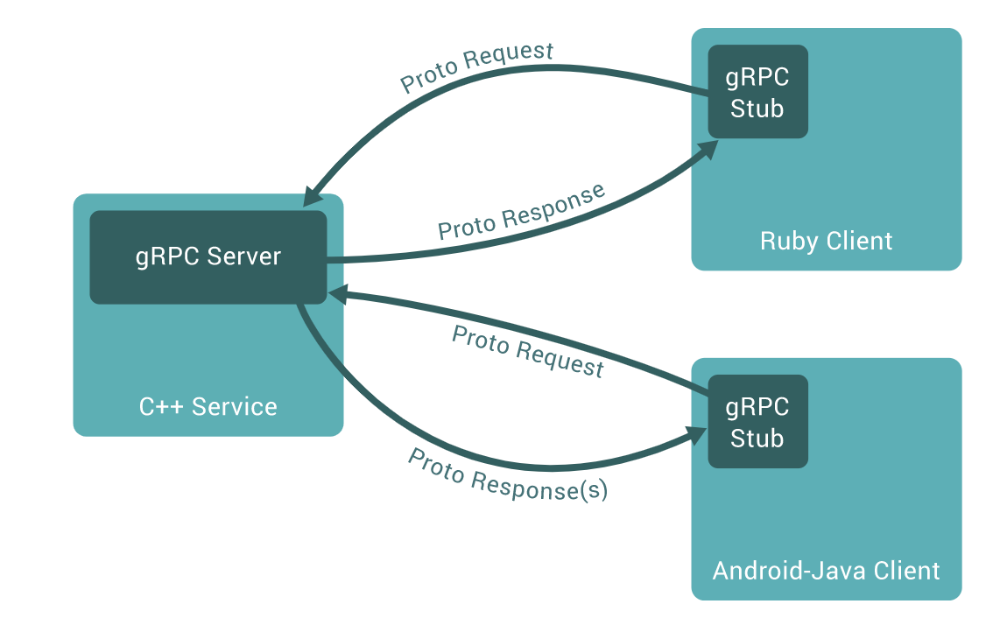
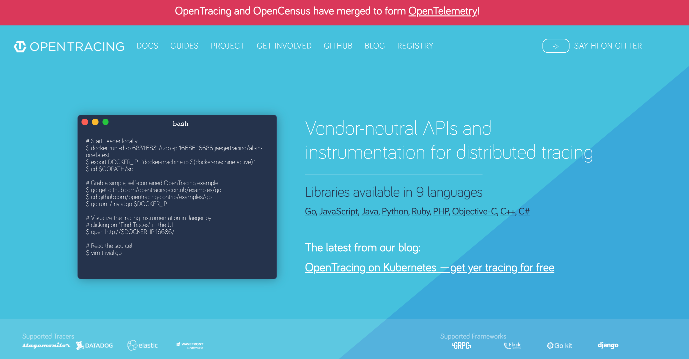
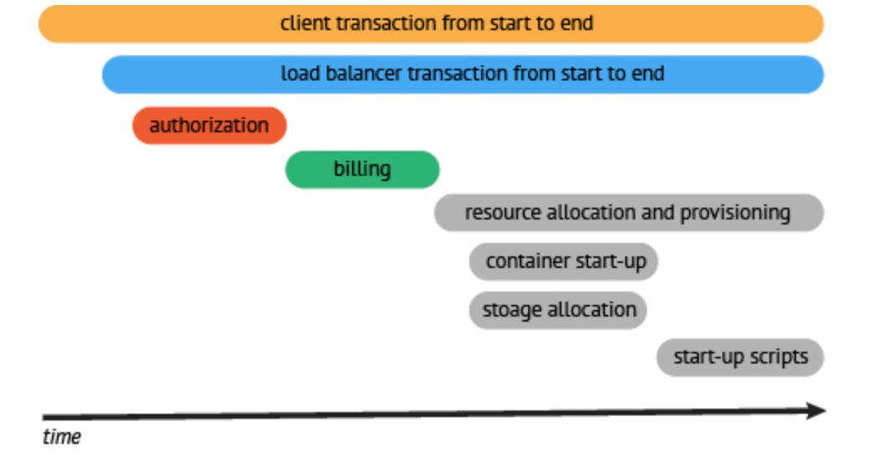
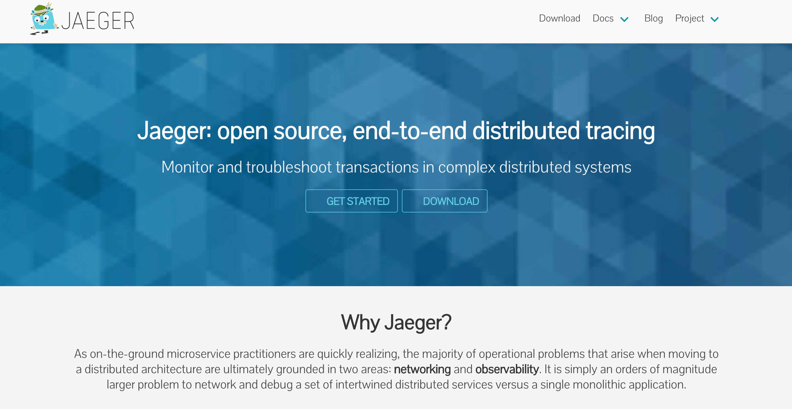
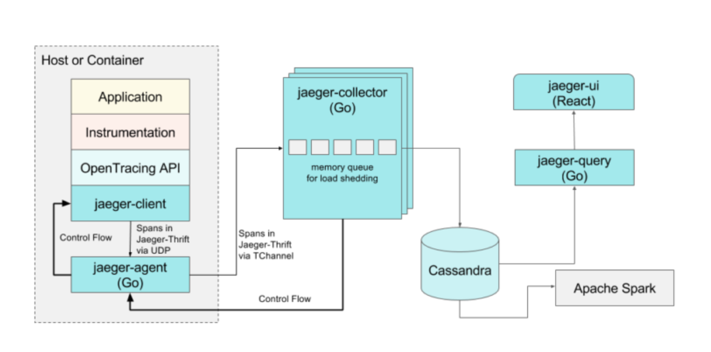
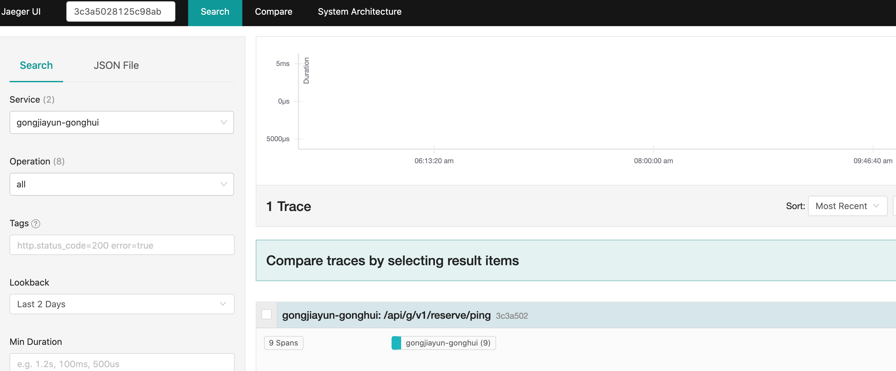

## 1) RPC

`Remote Procedure Call`

### 1) 概览


<!--truncate-->

### 2) 优势

```php
	简单、通用、安全、效率
```


## 2) GRPC


### 1) 简介

```php
gRPC 是一个高性能、开源和通用的 RPC 框架，面向移动和 HTTP/2 设计
```


`ps: 多语言支持`

- C++
- C#
- Dart
- Go
- Java
- Node.js
- Objective-C
- PHP
- Python
- Ruby


### 2) 概览




### 3) Protocol Buffers

```php
Protocol Buffers是一种与语言无关，平台无关的可扩展机制，用于序列化结构化数据。使用Protocol Buffers可以一次定义结构化的数据，然后可以使用特殊生成的源代码轻松地在各种数据流中使用各种语言编写和读取结构化数据
```

​	

示例

`example.proto`

```protobuf
syntax = "proto3"; // 版本声明，使用Protocol Buffers v3版本

package pb; // 包名


// 定义服务
service Trainee {

    // 方法
    rpc Sing (HelloRequest) returns (HelloReply) {}
    
    // 方法
    rpc Dance (HelloRequest) returns (HelloReply) {}
    
    // 方法
    rpc Rap (HelloRequest) returns (HelloReply) {}
}

// 请求消息
message HelloRequest {
    string name = 1;
}

// 响应消息
message HelloReply {
    string message = 1;
}
```


## 3) opentrace


### 1) [ 官网](https://opentracing.io/)




### 2) 问题

```php
解耦成大量微服务时，以前很容易实现的重点任务变得困难了。
过程中需要面临一系列问题：用户体验优化、后台错误原因分析，分布式系统内各组件的调用情况等
```


### 3) why open trace?

```php
OpenTracing通过提供平台无关、厂商无关的API，使得开发人员能够方便的添加（或更换）追踪系统的实现。
```

```php
# 多语言支持
Go, JavaScript, Java, Python, Ruby, PHP, Objective-C, C++, C#
```


### 4) 概念

#### 1) trace

```php
trace代表了一个事务或者流程在（分布式）系统中的执行过程
```

#### 2) span

```php
span代表trace中被命名并计时的连续性的执行片段
```





## 4) jaeger

#### 1) [官网](https://www.jaegertracing.io/)




#### 2) 简介

```php
Jaeger是Uber的分布式跟踪系统。
```




#### 3) 安装

##### 1) `docker`

```php
docker run -d --name test-jaeger \
  -u root \
  --privileged=true \
  -e COLLECTOR_ZIPKIN_HTTP_PORT=9411 \
  -p 5775:5775/udp \
  -p 6831:6831/udp \
  -p 6832:6832/udp \
  -p 5778:5778 \
  -p 16686:16686 \
  -p 14268:14268 \
  -p 14250:14250 \
  -p 9411:9411 \
  jaegertracing/all-in-one:1.21
```


##### 2) 官网下载二进制文件

`...`


##### 3) github下载发行版本

`...`


浏览器输入 `http://0.0.0.0:16686/`, 看到以下界面则表示成功




