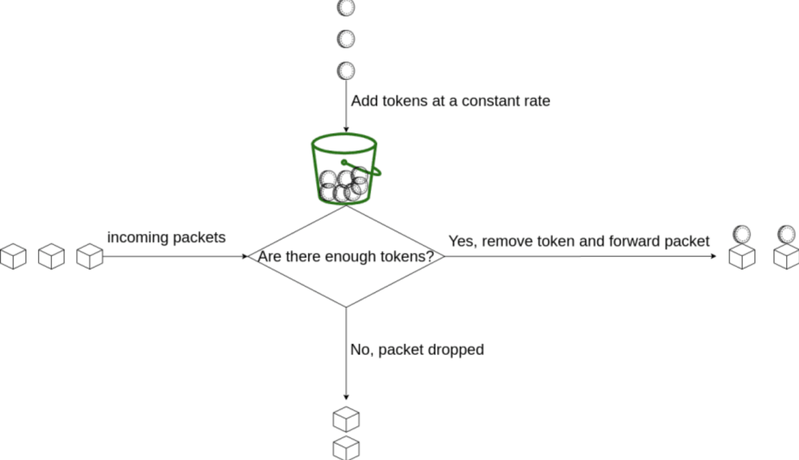

# go-tokenlimit

one of rate limit - token bucket, written in go


<!--truncate-->

## 项目地址:

https://github.com/sado0823/go-tokenlimit


## what?

```js
之前聊bbr自适应限流的时候, 说到了 `令牌桶` 和 `漏桶` 的限流算法, 今天的主角就是 `令牌桶` - `token bucket`.

可以概括如下:
	- 令牌桶: 限流 (`Token Bucket`)
    - 漏桶: 整流 (`Leaky Bucket`)

令牌桶算法的原理是系统会以一个恒定的速度往桶里放入令牌，而如果请求需要被处理，则需要先从桶里获取一个令牌，当桶里没有令牌可取时，则拒绝服务。如果令牌已经满了，则丢弃令牌
```


## why?

```js
相信大家都很熟悉, 在web服务中, 有时手动的调整流量限速的阈值,  并且允许一定的流量峰值场景, 这种情况下`令牌桶`就可以派上用场了
```

限流特点是:

* 当bucket满了的时候, 将不在放入新的token, 不能超过最先限制值
* 按照一定的速率进行token的增加
* 允许一次性消耗全部token, 即允许一定的流量峰值存在


## how?

### 基本思想

通过维护一个具有容量上限的`token`桶, 有`token`则请求通过, 无则失败, 不断的消耗和补充这个桶, 从而达到限流的效果




### 执行过程

1. 首先有一个`桶`, 里面装满了`token`, 存在一个`容量上限`
2. 用恒定的速率往`桶`中填入`token`, 填满则`丢弃token`
3. 每次请求进来, 取走一个`token`, 如果没有可用的`token`, 则`拒绝请求`


### 源码分析

该实现为通过`lua`脚本, 在`redis`中维护`桶`的计数, 如果`redis`宕机了, 则由`go`自带的`"golang.org/x/time/rate"` 进行兜底

`lua.lua`

````lua
local rate = tonumber(ARGV[1])
local cap = tonumber(ARGV[2]) -- 最大容量
local now = tonumber(ARGV[3]) -- 当前时间戳
local requested = tonumber(ARGV[4]) -- 需要去除的token数量
local fill_time = cap/rate
local ttl = math.floor(fill_time*2) -- 给一定的过期时间, 使得token恢复平滑

-- KEYS[1]: token key 上次剩余值
local last_tokens = tonumber(redis.call("get",KEYS[1]))
if last_tokens == nil then
	last_tokens = cap
end

-- KEYS[2]: token refreshed timestamp 上一次刷新token的时间戳
local last_refreshed = tonumber(redis.call("get",KEYS[2]))
if last_refreshed == nil then
	last_refreshed = 0
end

-- 计算时间差值
local delta = math.max(0, now-last_refreshed)
-- 时间差值x增加速率 + 上次剩余值, 计算出当前可用值
local left = math.min(cap,last_tokens+delta*rate)
local new_tokens = left
-- 可用值 > 请求值, 则通过
local allowed = left >= requested
if allowed then
  new_tokens = left - requested
end

redis.call("setex", KEYS[1], ttl, new_tokens)
redis.call("setex", KEYS[2], ttl, now)

return allowed
````


`tokenlimit.go`

主函数里使用的是一个`interface`, 为以后添加别的存储引擎留下了可能性 (大概率也不会用别的存储了...)

```go
RedisI interface {
		Eval(ctx context.Context, script string, keys []string, args ...interface{}) (interface{}, error)
		IsErrNil(err error) bool
		Ping() bool
}
```


`tokenlimit.go`

最终实现限流器的结构体

```go
Limiter struct {
		rate int // generate token number each second
		cap  int // at most token to store

		local *xrate.Limiter // limiter in process

		remote         RedisI // for distributed situation, can use redis
		tokenKey       string
		tsKey          string // timestamp key, tag get token time
		remoteMu       sync.Mutex
		remoteAlive    uint32 // ping remote server is alive or not
		monitorStarted bool
}

// New a Limiter
func New(rate, cap int, store RedisI, key string) *Limiter {
	return &Limiter{
		rate:        rate,
		cap:         cap,
		local:       xrate.NewLimiter(xrate.Every(time.Second/time.Duration(rate)), cap),
		remote:      store,
		tokenKey:    fmt.Sprintf(tokenFormat, key),
		tsKey:       fmt.Sprintf(timestampFormat, key),
		remoteAlive: 1,
	}
}
```


`tokenlimit.go`

新建`redis`存储的助手函数, 提供`dsn`即可

```go
func NewStore(addr string) RedisI {
	return redisx.New(addr)
}
```


## example

```go
func test() {
	const (
		total = 100
		rate  = 5
    	burst = 10
	)
  
  limiter := New(rate, total, NewStore("127.0.0.1:6379"), "test-token-limit")
  
  var allowed int
  for i := 0; i < total; i++ {
    
    time.Sleep(time.Second / time.Duration(total))
    
    if limiter.Allow() {
      allowed++
    }
    
  }
  
  	fmt.Printf("Test_Remote: allowed:%d, burst:%d, rate:%d \n", allowed, burst, rate)
}

```


## references

1. [go-zero](https://github.com/tal-tech/go-zero)
2. [wiki](https://en.wikipedia.org/wiki/Token_bucket)
3. [token-bucket](https://dev.to/satrobit/rate-limiting-using-the-token-bucket-algorithm-3cjh)
