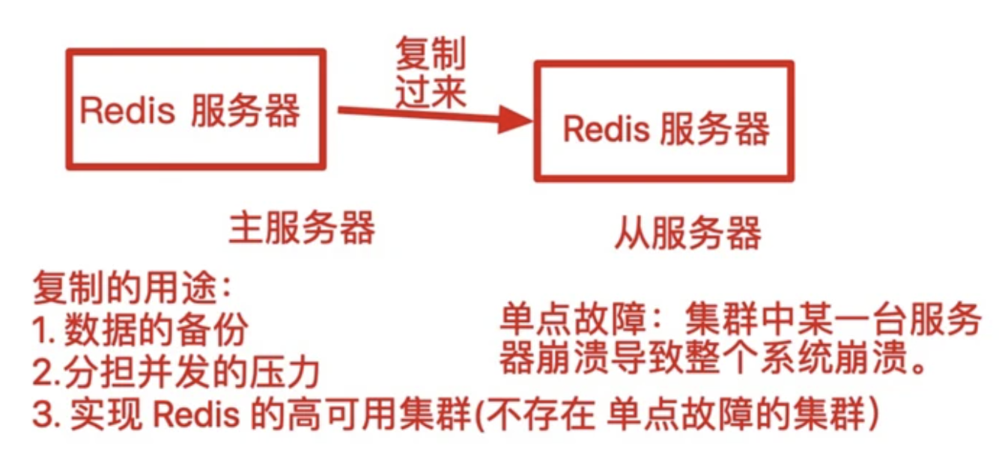
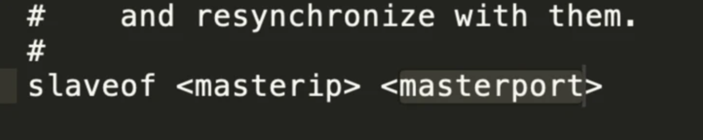
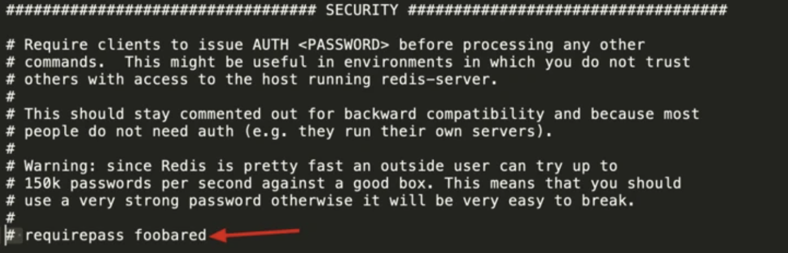
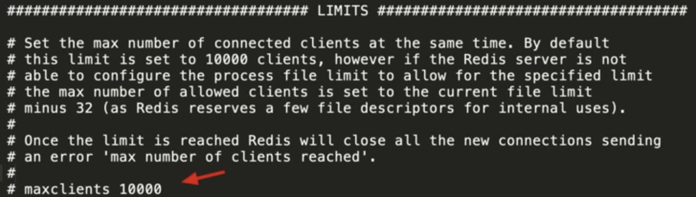
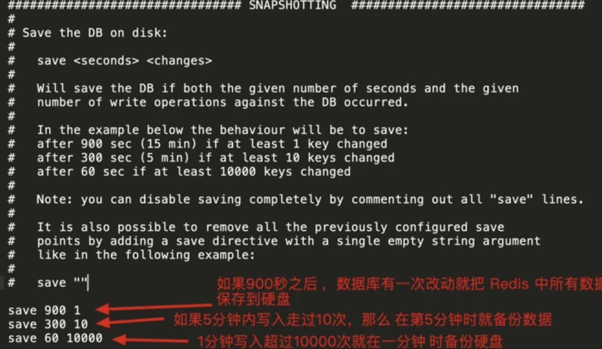
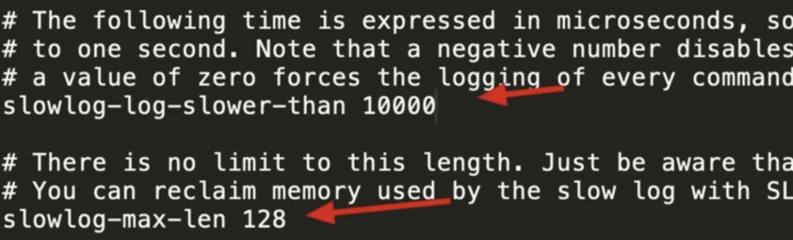

# Redis

Redis 是一种内存数据库，它主要是用来`提高网站性能`的。


## 安装

### Docker 安装+启动

1. 下载 Redis 镜像

~~~
docker pull redis
~~~

2. 创建并启动容器

~~~
docker run -d --name redis -p 6379:6379 redis
~~~

### mac 安装+启动

1.安装命令

```
brew install redis
```

2.修改配置文件
```
vim /usr/local/etc/redis.conf
```

3.默认情况下绑定了本机127的ip,不允许远程访问
```
 #bind 127.0.0.1
protected-mode yes 

改为 

protected-mode no
```
4.测试是否安装成功
```
redis-cli ping
```
5.启动/关闭/重启 服务
```
brew services start/stop/restart redis 
或 
redis-server /usr/local/etc/redis.conf  
```
6.bash交互界面
```
redis-cli
```

### windows 安装+启动

下载软件包，解压缩，软件包中最重要的三个文件：

- redis-server：服务器程序
- redis-cli：客户端程序
- redis.windows.conf：配置文件

在 windows 中直接打开命令行并运行 redis-server 即可启动服务器。

方法一:

```html
redis-server.exe redis.windows.conf  // 先切换到redis根目录,windows下启动,带配置文件
```

方法二:

```html
1) 添加根目录为环境变量
2) 启动
redis-server.exe D:\redis\redis.windows.conf	//配置文件目录用绝对路径
```

启动之后默认监听 `6379` 端口。


## 连接

服务器启动之后，就可以使用 `redis-cli` 来连接服务器进行操作。

打开命令行并执行 `redis-cli`


## 退出

在命令行中执行 `exit` 退出连接。


## 数据类型

Redis 中提供了多种数据类型来保存数据：

- 字符串（string)
- 列表（list）
- 集合（set）
- 有序集合（sorted set）
- 哈希（hash）

每种数据类型都提供了很多指令来进行操作：

http://doc.redisfans.com/


## 字符串(string)

### get、set

字符串是最基本的数据类型。

使用 `set` 指令来保存字符串数据：

~~~
set 键 值
~~~

值最大为 `512M`。


使用 `get` 指令读取字符串数据：

~~~
get 键
~~~


### incr、decr

还可以对数字类型使用 `incr` 和 `decr` 实现 加1 和 减1 操作。

~~~
set money 100
incr money       // 101
incr money       // 102
decr money       // 101
~~~


也可以使用 `incrby 数字` 和 `decrby 数字` 实现 加N 和 减N 操作。

~~~
set money 100
incrby money 50    // 150
decrby money 20    // 130
~~~


### mget、mset

我们也可以使用 `mget` 和 `mset` 批量添加和读取数据。

~~~
mset a 10 b 10 c 10
mget a b c     // 10  20  30
~~~


### exists、del、type

exists ：判断一个键是否存在。

del：删除一个键值对

type：查看数据类型

~~~
set name 'tom'
type name     // string
exists name   // 1
del name      // 1
exists name   // 0
~~~


### expire

我们可以为 Redis 中保存的数据设置一个过期时间 ，过期时间到了之后会自动从 Redis 中删除该数据。

使用 `expire` 设置过期时间：

~~~
expre 键 过期时间(秒)	//需要实现set设置过值
~~~

可以使用 `ttl` 指令查看剩余的过期时间。

~~~
ttl 键	// -1: 已过期    -2: 未设置
~~~

也可以在 set 时设置过期时间：

~~~
set 键 值 ex 过期时间
~~~


### 应用场景

主要用来做网站数据的缓存，比如：使用 Redis 保存 “销量最高的10件商品”、“最活跃的用户”等等。


## 列表(list)

列表（ List ）是一种按顺序保存一组数据的结构，有点类型于数组。


### lpush、rpush

lpush：从列表`左侧`添加一个数据。

rpush：从列表`右侧`添加一个数据。

~~~
lpush 键 值
~~~

比如：

~~~
lpush class php     // php
lpush class js      // js php
lpush class css     // css js php
rpush class html    // css js php html

// 也可以一次添加多个值
lpush class a b c   // c b a css js php html
~~~


### lrange

lrange：从左侧取出多个值，读取之后值还在列表中。

~~~
lrange 键 开始下标 结束下标
~~~

下标说明：

1. 从 0 开始
2. 可以使用负数，-1：最后一个 ， -2：倒数第2个


### lpop、rpop、rpoplpush

lpop：最出最左侧的一个值，然后从列表中删除该值。

rpop：从右侧取出一个值，然后从列表中删除该值。

rpoplpush：从列表右侧取出一个值，然后放到另一个列表的左侧。

~~~
lpush class a b c    // c b a
rpoplpush class class   // a c b
rpop class           // 得到 a ，列表变成 c b
lpop class           // 得到 c , 列表变成 b
~~~


### ltrim

ltrim：语法和 lrange 类似，功能是截取出列表中一个范围的数据，范围外的数据被删除。

~~~
lpush class a b c d   // d c b a
ltrim class 1 2       // 队列中只剩 c b
~~~


### brpop

b：阻塞。

brpop：从列表右侧取出一个数据，如果列表中没有数据就阻塞等待，直到有另一个客户端向列表中添加了数据才返回。

~~~
brpop 键 等待时间(秒)
~~~

等待时间如果设置为 0 则代表永远等待直到有数据为止。


应用场景：消息队列。


### 应用场景

1. 秒杀、抢票
2. 保存最新前N的xxx数据(`最新排行榜`)
3. 消息队列


## 哈希(hash)

哈希（Hash）用来保存多组键值对的数据，有些类似于 PHP 中的关联数组。


### hmset

hmset：可以保存 hash 数据。

~~~javascript
hmset 键 字段1 值1 字段2 值2 ...
~~~

示例、保存 ID=100 的用户信息

~~~javascript
hmset user:100 name tom gender 男 birth 2019-10-10
~~~


### hget 和 hgetall

hget：获取某一个字段值

hgetall：获取所有字段值


## 集合(set)

集合（set）是一组 `无序`、`不重复`的字符串。


### sadd、smembers、sismember

sadd：向集合中添加数据

smembers：获取集合中所有数据

sismember：判断一个数据是否在集合中

~~~
sadd nums 1 2 3  
smembers nums      // 1 2 3
sismember nums 3   // 1
sismember nums 4   // 0
~~~


### spop、srem、smove

spop：从集合中随机取出一个数据，并从集合中删除该数据。

srem：从集合中移动一个或者多个元素

smove：将一元素从一个集合移动到另一个集合


### sunion、sinter、sdiff

sunion：返回多个集合的并集

sinter：返回多个集合的交集

sdiff：前一个集中有，后一个集合中没有的数据


交集：同时在多个集合中


并集：合并集合


### 总结

1. 集合中的数据不重复
2. 无序

### 应用场景

a. 好友系统 b. 发牌游戏  c. 抽奖等


## 有序集合(zset)

有序集合（sorted sets）：是一组有 `顺序` 、`不重复`的一数据。

集合中的每个数都可以设置一个分值，然后就可以根据分值进行排序。


### zadd

可以使用 `zadd` 向集合中添加数据。

~~~
zadd 键名 分值 数据
~~~


### zrange

zrange：取出排在某个区间内的成员。

~~~
zrange 键名 开始下标 结束下标 withscores
~~~

示例、显示整个有序集成员

~~~
redis > ZRANGE salary 0 -1 WITHSCORES             
1) "jack"
2) "3500"
3) "tom"
4) "5000"
5) "boss"
6) "10086"
~~~

示例、显示排在2、3位的成员

~~~
redis > ZRANGE salary 1 2 WITHSCORES
1) "tom"
2) "5000"
3) "boss"
4) "10086"
~~~


### zrank

zrank：获取某个成员的排名

~~~
zrank 键名 值
~~~


### 总结

1. 值不重复
2. 有顺序


### 应用场景

排行榜、浏览量、商品销量等等


## 频道(channel)

### 订阅

我们可以使用 `subscribe` 订阅一个或者多个频道，当有客户端向频道发消息时就可以收到。

~~~
subscribe 频道1 频道2 ...
~~~


### 发布

可以使用 `publish` 向一个频道中发送消息。

~~~
publish 频道 消息
~~~


### 场景

消息队列


## 事务(transaction)

事务可以使多个指令`都执行成功`，或者`都执行失败`，保存完整性。

### multi 、exec、discard

multi：开启一个事务，后续执行的指令将都保存到事务队列中（开启事务）

exec：执行事务队列中所有的指令（提交事务）

discard：取消事务，清除事务列表中所有指令（取消事务）


### watch、unwatch

watch：监听一个或者多个key，如果在执行一个事务时，监听的 key 被修改，那么中止执行会失败

unwatch：取消所有监听


## 常用应用

### 数据缓存

网站中很多数据频繁被使用，如果每次都查询数据库会非常 的慢，所以我们一般是先从数据库中把要使用的数据取出来然后保存到 Redis 中，然后设置一个个过期，比如30分钟，然后我们程序就从 Redis 中取出数据，如果数据过期，再重新 读取数据库，再保存到 Redis 中。


哪些可以缓存：网站中的数据只要不是实时都要变化的就都可以缓存，比如：销量排行（每天统计一次，统计完之后保存到 Redis 中）、精品推荐、最周最活跃的用户、最新的10篇等等 这些首屏的数据。


### 消息队列

消息队列可以对系统 `异步解耦`，以提高网站性能。


**消费者程序**

php.ini 中有一个配置项 `default_socket_timeout` ，这一项的意思：`连接一个服务器的超时时间`，默认是60秒，如果我们希望在队列中没有数据时一直保存连接等待那么就需要设置这一项值为-1。

使用 `brpop` 指令阻塞读取队列。

```php
// 设置 socket 永不超时
ini_set('default_socket_timeout', -1); 

// 循环监听一个列表
while(true)
{
    // 从队列中取数据，设置为永久不超时
    $data = $redis->brpop(队列名称, 0);
    // 处理数据
    ....... (比如发邮件)
}
```


**生产者程序**

使用 `lpush` 向队列中加入数据。

```php
$redis->lpush(队列名称, 数据);
```


简单实例

1. 消费者程序

这个程序负责在后台一直运行，它负责发邮件，所以项目中当有功能需要发邮件时，直接把邮件内容放到 `user_emails` 列表中即可，然后这个后台程序会负责发邮件。

~~~php
<?php
// 连接永不断开
ini_set('default_socket_timeout', -1); 

// 消费者程序
// 模块发邮件
function sendMail($content)
{
    sleep(2);
    file_put_contents('./mails/'.time(), $content);
}

// 监听消息队列，从队列中取出消息然后发邮件
require('./vendor/autoload.php');

// 连接 Redis
$client = new \Predis\Client([
    'scheme' => 'tcp',
    'host'   => '127.0.0.1',
    'port'   => 6379,
]);

echo "发邮件程序已经启动...\n";

while(true)
{   
    // 从队列的右侧取出消息，如果队列中没有消息就阻塞
    $message = $client->brpop('user_emails', 0);
    echo "收到消息，准备发邮件...\n";
    // 取出消息之后就发邮件
    sendMail($message[1]);
    echo "邮件发送成功，开始监听下一个！\n";
} 


~~~

2. 生产者程序

当有程序需要发邮件时，只需要把消息放到队列中然后消费者程序会在后台发给我们发邮件。

~~~php
<?php
// 负责注册

$user = 'tom';
$password = '12123';

$sql = 'insert into USER ...';

echo '数据库成功！';
echo '注册成功！';

// 监听消息队列，从队列中取出消息然后发邮件
require('./vendor/autoload.php');

// 连接 Redis
$client = new \Predis\Client([
    'scheme' => 'tcp',
    'host'   => '127.0.0.1',
    'port'   => 6379,
]);
// 出消息队列中放消息
$client->lpush('user_emails', '注册成功！欢迎加入！');

echo '完成 ！！！';
~~~


总结：

1. 消息队列用来解决系统的异步解耦
2. 消息队列软件 ：Redis、kafka、Rabbmq等等
3. 消费者程序是在后台不间断的执行的
4. 消费者程序在后台需要使用多进程不间断的执行（在PHP 里要使用 Swoole 或者 wokerman 来实现多进程）
5. 在分布式系统和集群时使用


在连接 Redis 时可以使用 `select` 来切换数据库。

数据库主要用来在内存中把数据隔离开。

## 配置

### 复制

主从服务器。




搭建主从服务器只需要修改配置文件：然后开启这个服务器就是从服务器：

masterip：主服务器 IP 地址

masterport：主服务器端口号




### 安全

 Redis 一般都是运行服务器内网中，不会暴露在外网，所以一般不需要设置密码，都是内部程序自己使用，如果要设置密码可以使用下面这一项：



一旦设置了密码，客户端在连接 Redis 之后，必须先使用 `auth 密码` 指令进行登录 ，登录成功之后才能执行其他的操作。


### 并发限制

Redis 默认允许  10000 个客户端同时连接，如果要修改也可以：



### 快照(RDB)

为了防止  Redis 中的数据丢失，所以会定期向硬盘保存数据。




每次将内存中所有的数据都备份到硬盘 。

### AOF

AOF：把数据从内存备份到硬盘。

只把新的数据追回到硬盘。

是否开启：

```
appendonly on
```

什么时候触发写硬盘：

always：一修改Redis 同时就写硬盘，（好处：数据不会丢失，缺点：性能慢）

everysec：每秒写硬盘一次，（好处：性能稍微好些，缺点：有可能丢失一秒的数据）

```
appendfsync always
appendfsync everysec
appendfsync no
```


扩展：集群方案。

使用不写硬盘数据有可能丢失，如果写硬盘性能会慢，所以这样一个方案。

搭建主从服务器，主服务器完全不写硬盘，从服务器写硬盘。

### 慢日志

MySQL 中也有慢日志。

慢日志：把执行慢的语句保存到一个日志文件中，然后我们就可以通过查看日志知道网站中哪些功能拖慢网站，然后就可以针对性的优化。

可以配置一个时间 ，当一个指令执行时间超过这个时间 就会记录到慢日志中。


